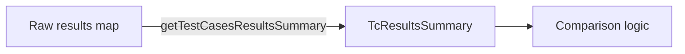

getTestCasesResultsSummary`

| Aspect | Detail |
|--------|--------|
| **Location** | `cmd/certsuite/claim/compare/testcases/testcases.go` (line 70) |
| **Visibility** | Unexported – used only inside the *testcases* package. |
| **Signature** | `func getTestCasesResultsSummary(results map[string]string) TcResultsSummary` |

### Purpose
Transforms a simple mapping of test‑case names to their result strings into a richer `TcResultsSummary` value that aggregates the overall status and stores individual results.

Typical usage: after collecting raw results from an external source (e.g., a CSV, JSON payload, or API response), this helper normalises them into the internal representation expected by other parts of the package (such as reporting or comparison logic).

### Parameters
- **`results`** – `map[string]string`
  - Key: test‑case identifier (`tcName`).  
  - Value: raw result string (e.g., `"PASS"`, `"FAIL"`, `"SKIP"`).  
  The map may be empty; the function will still produce a summary with zero counts.

### Return Value
- **`TcResultsSummary`**
  - Contains:
    - `Total`: total number of test cases processed.
    - `Passed`: count of `"PASS"` results.
    - `Failed`: count of `"FAIL"` results.
    - `Skipped`: count of `"SKIP"` (or other non‑pass/fail) results.
    - `Results`: the original map for reference.

### Key Dependencies
- **`TcResultsSummary` type** – defined in the same package.  
  The function relies on this struct to return a structured summary.
- No external packages are imported; all logic is self‑contained.

### Side Effects
- None. The function only reads its input map and constructs a new value; it does not modify global state or the input map itself.

### How It Fits the Package
The *testcases* package provides utilities for comparing test results between different CertSuite claims. `getTestCasesResultsSummary` is a low‑level helper that converts raw result data into the structured format used by higher‑level comparison functions (e.g., `compareResultSummaries`). By centralising this transformation, the rest of the code can work with strongly typed summaries rather than ad‑hoc maps.

---

**Bottom line:**  
`getTestCasesResultsSummary` is a pure, read‑only conversion helper that aggregates per‑test-case results into an easily consumable summary struct for the rest of the *testcases* package.
