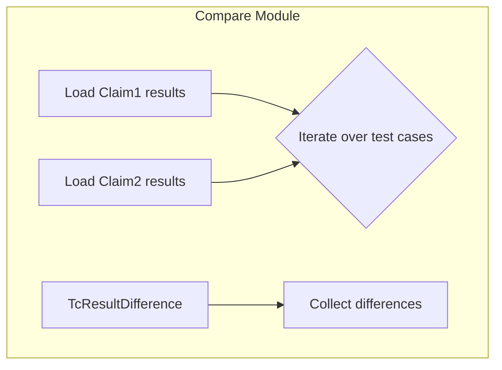

TcResultDifference`

| Item | Detail |
|------|--------|
| **Package** | `github.com/redhat-best-practices-for-k8s/certsuite/cmd/certsuite/claim/compare/testcases` |
| **File** | `testcases.go:16` |
| **Exported** | Yes |

### Purpose
`TcResultDifference` is a lightweight container that represents the outcome of comparing two claim results for a single test case.  
The certsuite CLI uses this struct to report, log, or further process discrepancies between the result sets produced by two distinct claims (e.g., `claim1` vs. `claim2`).  

### Fields
| Field | Type   | Meaning |
|-------|--------|---------|
| `Name`          | `string` | The unique identifier of the test case being compared. |
| `Claim1Result`  | `string` | The result string reported by **Claim 1** for this test case (e.g., `"pass"`, `"fail"`). |
| `Claim2Result`  | `string` | The result string reported by **Claim 2** for this test case. |

The struct has no methods; it is purely a data holder.

### Dependencies & Usage Flow

1. **Claim result loaders** read the JSON/YAML files produced by each claim execution.  
2. For every test case, a `TcResultDifference` is instantiated with the name and the two result strings.  
3. These structs are aggregated (e.g., into a slice) and then written out to stdout or a report file.

### Side‑Effects
- **None** – the struct only stores values; creating it has no external impact.
- It may be serialized to JSON/YAML for reporting, but that occurs outside of this type itself.

### How It Fits the Package
`testcases` is the sub‑package responsible for handling test‑case level comparisons.  
`TcResultDifference` sits at the core of that logic: every comparison yields one instance of this struct, which the package then uses to generate human‑readable diff reports or machine‑parsable data.

> **Note:** No other functions in this package directly touch `TcResultDifference`, so its usage is confined to the compare workflow described above.
