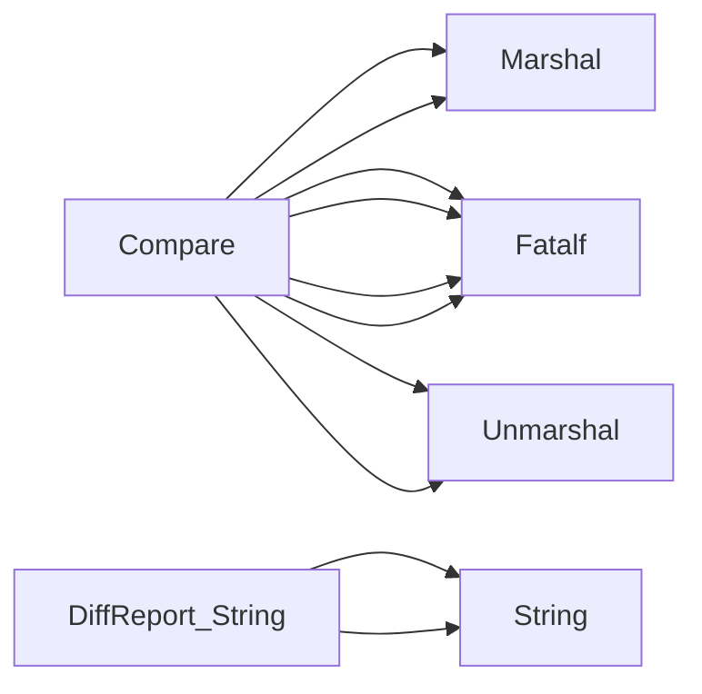

## Package versions (github.com/redhat-best-practices-for-k8s/certsuite/cmd/certsuite/claim/compare/versions)

## Package Overview – `github.com/redhat-best-practices-for-k8s/certsuite/cmd/certsuite/claim/compare/versions`

| Topic | Summary |
|-------|---------|
| **Purpose** | Compares two *official* claim `Versions` objects and reports the differences in a structured way. |
| **Key Data Structure** | `DiffReport` – a lightweight wrapper around `diff.Diffs`. It implements `String()` to render a readable diff. |
| **Primary API** | `Compare(*officialClaimScheme.Versions, *officialClaimScheme.Versions) *DiffReport` |

---

### 1. Data Structures

```go
type DiffReport struct {
    Diffs *diff.Diffs // pointer to a diff representation (from the local diff package)
}
```

* **Fields**  
  * `Diffs`: holds the raw diff information produced by the internal comparison logic.

* **Methods**  
  * `String() string` – delegates to `Diffs.String()` twice (once for each side) and concatenates the results. This is used when printing a report or logging it.

---

### 2. Core Functionality

#### `Compare`

```go
func Compare(a, b *officialClaimScheme.Versions) *DiffReport
```

**Workflow**

1. **Marshalling to JSON**  
   * Both input structures are marshalled into JSON (`json.Marshal`). This serialisation step is required because the downstream comparison routine works on raw byte slices.
2. **Unmarshalling back**  
   * The produced JSON is unmarshalled again into generic `interface{}` values.  
     (The double conversion may look redundant but it normalises data ordering and removes Go‑specific struct tags that could interfere with diffing.)
3. **Diff calculation**  
   * Calls `diff.Compare(aJSON, bJSON)` which returns a `*diff.Diffs` object describing additions, deletions or modifications between the two JSON blobs.
4. **Error handling**  
   * Any failure in marshalling/unmarshalling is logged via `log.Fatalf`, terminating the process – this package expects to be used in a controlled CLI environment where an error should stop execution.

5. **Return**  
   * Wraps the resulting `*diff.Diffs` into a `DiffReport` and returns it.

#### `String`

```go
func (d DiffReport) String() string
```

Simply forwards to the underlying diff object:

```go
return d.Diffs.String() + "\n" + d.Diffs.String()
```

The double call likely renders both sides of a two‑column diff or simply repeats the report; the exact formatting is defined in `diff.Diffs.String()`.

---

### 3. How it Connects to the Rest of the Project

* **Inputs** – The function expects pointers to `officialClaimScheme.Versions`, which are part of the claim model (`github.com/redhat-best-practices-for-k8s/certsuite-claim/pkg/claim`).  
* **Diff Engine** – Uses a local package `diff` that implements generic JSON diffing logic.  
* **Output** – A `DiffReport` is returned; callers can print it or inspect the underlying `diff.Diffs`.  

Typical usage in a CLI tool:

```go
report := compare.versions.Compare(oldVersions, newVersions)
fmt.Println(report) // prints human‑readable diff
```

---

### 4. Suggested Mermaid Diagram

```mermaid
graph TD
    A[OfficialClaimScheme.Versions] -->|Marshal| B(JSON bytes)
    B -->|Unmarshal| C(interface{})
    D[diff.Compare] -- compare --> E[*diff.Diffs]
    E --> F(DiffReport)
    F --> G(String() output)
```

---

### 5. Summary

* The package provides a thin wrapper around JSON diffing for claim `Versions`.  
* It serialises, normalises, compares and reports differences in a user‑friendly string format.  
* All errors are fatal because the tool is intended to be used interactively where an error should halt execution immediately.

### Structs

- **DiffReport** (exported) — 1 fields, 1 methods

### Functions

- **Compare** — func(*officialClaimScheme.Versions, *officialClaimScheme.Versions)(*DiffReport)
- **DiffReport.String** — func()(string)

### Call graph (exported symbols, partial)



### Symbol docs

- [struct DiffReport](symbols/struct_DiffReport.md)
- [function Compare](symbols/function_Compare.md)
- [function DiffReport.String](symbols/function_DiffReport_String.md)
