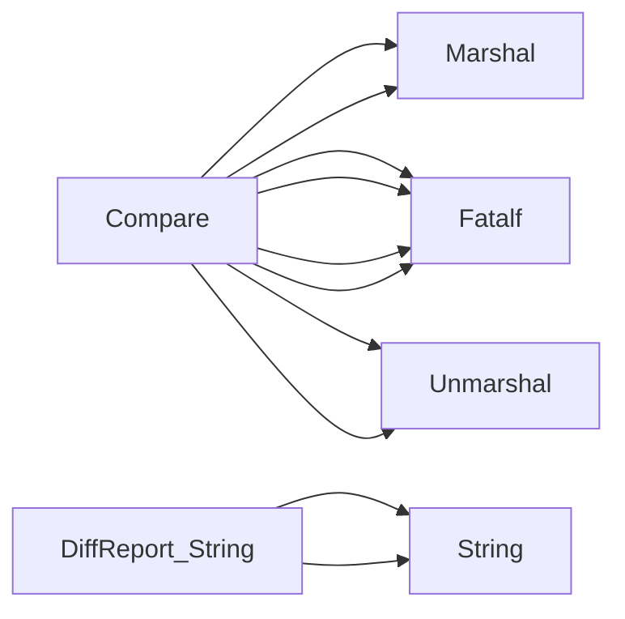

## Package versions (github.com/redhat-best-practices-for-k8s/certsuite/cmd/certsuite/claim/compare/versions)

### Structs

- **DiffReport** (exported) — 1 fields, 1 methods

### Functions

- **Compare** — func(*officialClaimScheme.Versions, *officialClaimScheme.Versions)(*DiffReport)
- **DiffReport.String** — func()(string)

### Call graph (exported symbols, partial)

### Symbol docs

- [struct DiffReport](symbols/struct_DiffReport.md)
- [function Compare](symbols/function_Compare.md)
- [function DiffReport.String](symbols/function_DiffReport_String.md)
