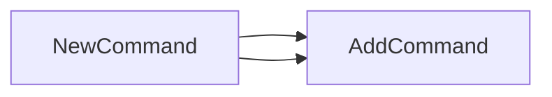

## Package show (github.com/redhat-best-practices-for-k8s/certsuite/cmd/certsuite/claim/show)

# Overview – `cmd/certsuite/claim/show`

The **`show`** package is a thin wrapper that stitches together several sub‑commands for the Certsuite CLI.  
It does not expose any custom data structures; its sole responsibility is to create and register a Cobra command hierarchy under the *`certsuite claim show`* namespace.

---

## Global state

| Name          | Visibility | Type | Notes |
|---------------|------------|------|-------|
| `showCommand` | unexported | `*cobra.Command` (declared implicitly) | Holds the root command for this sub‑module. It is created in `NewCommand()` and later returned to the parent package. |

> **Why a global?**  
> Cobra requires that each command be accessible by other packages when building the tree. Declaring it as a package‑level variable keeps the construction logic encapsulated while allowing external code (e.g., `cmd/certsuite/claim`) to register it.

---

## Key functions

| Function | Signature | Purpose |
|----------|-----------|---------|
| **`NewCommand()`** | `func() *cobra.Command` | Builds and configures the root `show` command, attaches sub‑commands from the `csv`, `failures`, and other sub‑packages, and returns it. |

### How `NewCommand` works

```go
func NewCommand() *cobra.Command {
    // 1️⃣ create the base "show" command
    showCommand = &cobra.Command{
        Use:   "show",
        Short: "Display claim results in various formats",
    }

    // 2️⃣ attach sub‑commands that provide concrete functionality
    showCommand.AddCommand(csv.NewCommand())
    showCommand.AddCommand(failures.NewCommand())

    // 3️⃣ return the fully‑wired command for registration by parent packages
    return showCommand
}
```

1. **Creation** – A new `*cobra.Command` is instantiated with a short description and stored in the global `showCommand`.
2. **Composition** – Sub‑commands are pulled from two dedicated subpackages:
   * `csv.NewCommand()` – prints results as CSV.
   * `failures.NewCommand()` – lists failed claims.
3. **Exposure** – The fully composed command is returned to be added to the CLI root elsewhere in the project.

---

## Package composition

```
certsuite
├── cmd
│   └── certsuite
│       ├── claim
│       │   ├── show          ← this package
│       │   │   ├─ csv        ← CSV output logic
│       │   │   └─ failures   ← Failure listing logic
│       │   └─ other sub‑commands…
```

- The `show` command is *not* a leaf; it aggregates the two child commands.  
- Each child package exposes its own `NewCommand()` that returns a fully configured `cobra.Command`.  
- When `certsuite claim show` is invoked, Cobra will delegate to either `csv` or `failures`, depending on the sub‑command chosen by the user.

---

## Suggested Mermaid diagram

```mermaid
graph TD;
    root[cmd/certsuite] --> claim[claim];
    claim --> show[show];
    show --> csv[csv.NewCommand()];
    show --> failures[failures.NewCommand()];

    style root fill:#f9f,stroke:#333,stroke-width:2px
```

This diagram visualizes the command hierarchy that `NewCommand()` assembles.

---

## Summary

- **No custom structs or interfaces** – the package is purely structural.
- **Global `showCommand`** holds the root Cobra command.
- **`NewCommand()`** builds the command tree, registers two sub‑commands (`csv`, `failures`), and returns the result for integration into the larger Certsuite CLI.

This minimal design keeps the command logic modular while maintaining a clean, testable entry point.

### Functions

- **NewCommand** — func()(*cobra.Command)

### Globals


### Call graph (exported symbols, partial)



### Symbol docs

- [function NewCommand](symbols/function_NewCommand.md)
