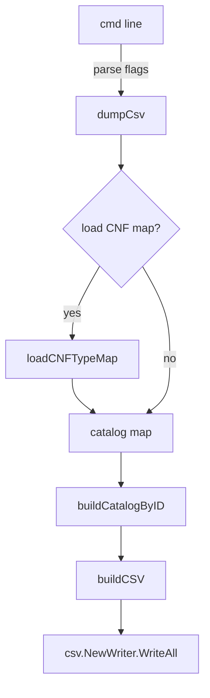
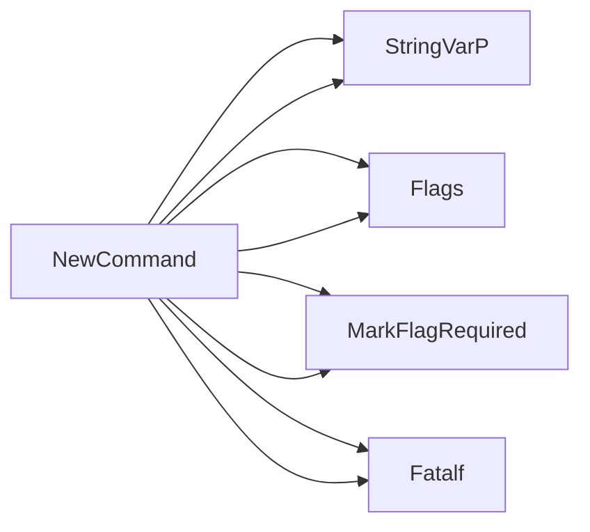

## Package csv (github.com/redhat-best-practices-for-k8s/certsuite/cmd/certsuite/claim/show/csv)

# `certsuite/cmd/certsuite/claim/show/csv` – CSV‑dumping subcommand

The package implements a **Cobra** command that reads a certsuite claim file and writes the
information in CSV format, optionally enriched with remediation text,
mandatory/optional status and CNF type data.

---

## Global state (flags & command)

| Variable | Type   | Purpose |
|----------|--------|---------|
| `claimFilePathFlag` | `string` | Path to the claim file (`-f`). Required. |
| `CNFNameFlag` | `string` | Name of a CNF component (`--cnf-name`). Optional – used only when enriching data. |
| `CNFListFilePathFlag` | `string` | Path to a CSV that maps CNF names → types (`--cnf-list-file`). Optional. |
| `addHeaderFlag` | `bool`   | If true, writes the CSV header row. |
| `CSVDumpCommand` | *cobra.Command* | The root command returned by `NewCommand`. |

`NewCommand()` wires these flags into a Cobra command and attaches
the handler `dumpCsv`.

---

## Core workflow

```
claim file  ──► load CNF map (optional) ──► build catalog   │
                                                    │
                                                build CSV │
                                            ┌────────────┘
                                            │
                                    output writer → stdout / file
```

1. **`dumpCsv(cmd, args)`** – entry point for the command  
   * parses flags (`cmd.Flags().Parse(args)`)  
   * validates claim version via `CheckVersion`  
   * optionally loads a CNF‑type mapping with `loadCNFTypeMap`  
   * builds an internal map of test case descriptions (`buildCatalogByID`)  
   * converts the claim schema to CSV rows (`buildCSV`)  
   * writes all rows using Go’s `csv.NewWriter`.  

2. **`loadCNFTypeMap(path)`** – reads a CSV where each row is
   ```json
   {"Name":"<cnf>", "Type":"<type>"}
   ```
   It returns a map `name → type`.

3. **`buildCatalogByID()`** – pulls the test‑case catalog from
   `claimschema.Catalog`. The result is a map indexed by test case ID,
   simplifying lookup during CSV construction.

4. **`buildCSV(claimSchema, cnfName, catalog)`** – core data transformer  
   * iterates over every test case in the claim file  
   * pulls description, remediation, mandatory flag from the
     catalog entry (if present)  
   * adds CNF type if `cnfName` is supplied and found in the CNF map  
   * returns a slice of string slices (`[][]string`) ready for CSV
     output.

---

## Key functions & responsibilities

| Function | Exported? | Responsibility |
|----------|-----------|----------------|
| `NewCommand()` | ✅ | Builds and configures the Cobra command. |
| `dumpCsv(cmd, args)` | ❌ | Command handler: orchestrates parsing, validation,
  data loading, CSV building, and writing. |
| `loadCNFTypeMap(path)` | ❌ | Loads CNF name → type mapping from a CSV file. |
| `buildCatalogByID()` | ❌ | Creates an ID‑indexed map of test case descriptions
  from the global catalog. |
| `buildCSV(schema, cnfName, catalog)` | ❌ | Transforms claim data into CSV rows,
  enriching with remediation and CNF type information. |

---

## How they connect

```
NewCommand() → sets flags & attaches dumpCsv()
dumpCsv() -> uses loadCNFTypeMap(), buildCatalogByID(),
             buildCSV() → csv.NewWriter.WriteAll()
```

The flag variables are read by `dumpCsv()` after parsing; any
additional data (CNF type map) is merged into the CSV rows.
`buildCSV` is purely functional – it takes a schema and returns a
2‑D string slice, making unit testing straightforward.

---

## Suggested Mermaid diagram



---

### Summary

This package provides a single Cobra subcommand that dumps a certsuite claim file into CSV, optionally augmenting each row with remediation details and CNF type information. The logic is split into clear, testable functions: flag handling → data loading → catalog lookup → CSV generation → output. No mutable global state beyond command‑line flags is used.

### Functions

- **NewCommand** — func()(*cobra.Command)

### Globals

- **CNFListFilePathFlag**: string
- **CNFNameFlag**: string
- **CSVDumpCommand**: 

### Call graph (exported symbols, partial)



### Symbol docs

- [function NewCommand](symbols/function_NewCommand.md)
