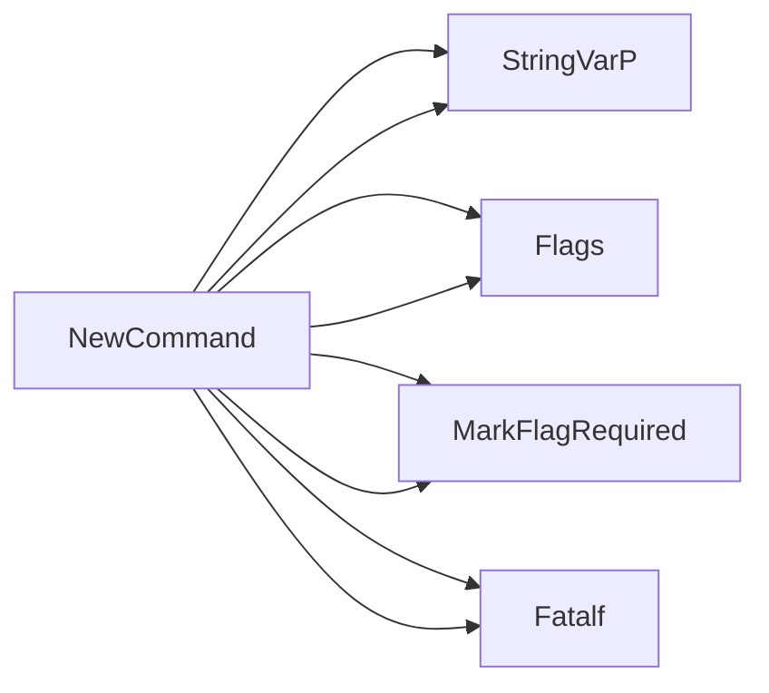

## Package csv (github.com/redhat-best-practices-for-k8s/certsuite/cmd/certsuite/claim/show/csv)

### Functions

- **NewCommand** — func()(*cobra.Command)

### Globals

- **CNFListFilePathFlag**: string
- **CNFNameFlag**: string
- **CSVDumpCommand**: 

### Call graph (exported symbols, partial)

### Symbol docs

- [function NewCommand](symbols/function_NewCommand.md)
