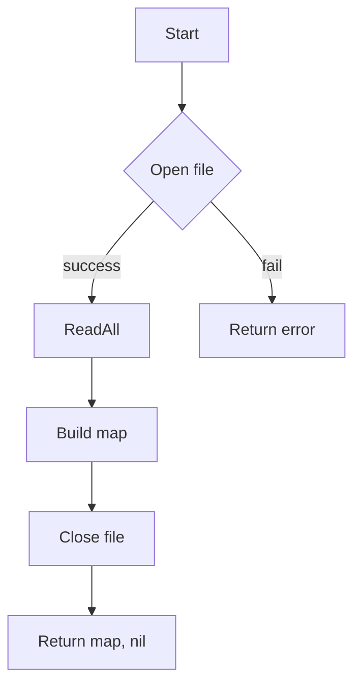

loadCNFTypeMap`

```go
func loadCNFTypeMap(path string) (map[string]string, error)
```

| Item | Detail |
|------|--------|
| **Purpose** | Reads a CSV file that maps CNF names to their type identifiers and returns the mapping as a Go map. |
| **Input** | `path` – filesystem path to the CSV file. |
| **Output** | A `map[string]string` where keys are CNF names (string) and values are type strings; or an error if any step fails. |

### How it works

1. **Open the file**  
   ```go
   f, err := os.Open(path)
   ```
   If opening fails, wrap the error with context and return.

2. **Read all rows**  
   ```go
   records, err := csv.NewReader(f).ReadAll()
   ```
   The reader parses the entire CSV into a slice of string slices. Any parse error is wrapped and returned.

3. **Close the file**  
   `defer f.Close()` ensures the handle is released even on errors.

4. **Build the map**  
   ```go
   cnfMap := make(map[string]string, len(records))
   for _, rec := range records {
       if len(rec) < 2 { continue }          // ignore malformed rows
       cnfName := strings.TrimSpace(rec[0])  // first column
       cnfType := strings.TrimSpace(rec[1])  // second column
       cnfMap[cnfName] = cnfType
   }
   ```

5. **Return**  
   The populated map is returned along with `nil` error.

### Key Dependencies

| Dependency | Role |
|-------------|------|
| `os.Open` | File access |
| `csv.NewReader` / `ReadAll` | CSV parsing |
| `strings.TrimSpace` | Normalises whitespace in fields |
| `fmt.Errorf` | Error wrapping with context |

### Side Effects

* The function only reads data; it does **not** modify the file or any global state.
* Errors are propagated upward; callers must handle them.

### Package Context

The `csv` package is part of the *certsuite* CLI that dumps claim information to CSV.  
`loadCNFTypeMap` is used by commands that need to resolve a CNF’s type from its name, e.g., when generating human‑readable reports or filtering output by CNF type.



---

**Note:** The function expects the CSV to have at least two columns per row (CNF name and type). Rows with fewer columns are silently skipped. If a CNF appears multiple times, the last occurrence wins.
