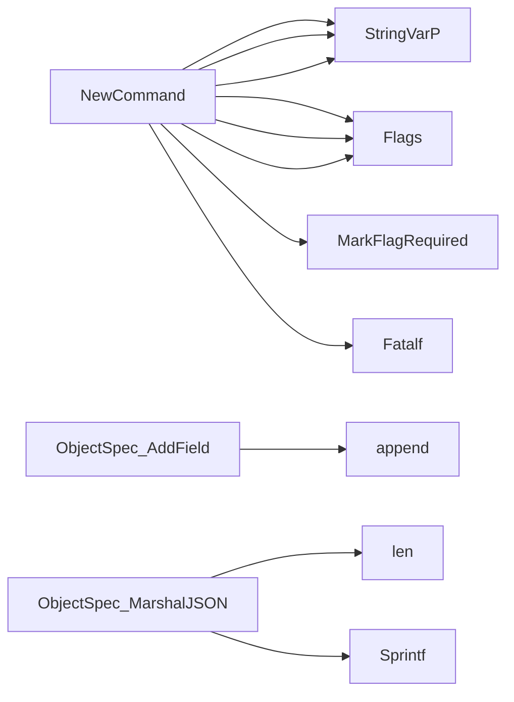

## Package failures (github.com/redhat-best-practices-for-k8s/certsuite/cmd/certsuite/claim/show/failures)

# certsuite – `show failures` command  
The **failures** sub‑command is part of the CertSuite CLI that extracts
non‑compliant test results from a claim file and presents them in either
plain text or JSON.

---

## 1. Data model

| Type | Purpose | Key fields |
|------|---------|------------|
| `NonCompliantObject` | Holds information about an object that failed a check.<br>Used only for pretty printing the failure reason.| `Reason string`, `Type string`, `Spec ObjectSpec` |
| `ObjectSpec` | A lightweight wrapper around a list of key/value pairs.  It implements custom JSON marshaling to match the format used in the claim’s `skipReason` field. | `Fields []struct{Key, Value string}`<br>**Methods:** `AddField(key,value)` and `MarshalJSON()` |
| `FailedTestCase` | One test case that failed inside a suite.<br>Represents the data that will be displayed to the user.| `TestCaseName`, `TestCaseDescription`, `CheckDetails` (raw string from claim), `NonCompliantObjects []NonCompliantObject` |
| `FailedTestSuite` | Group of failing test cases belonging to the same test suite.<br>Used as the top‑level item in the output.| `TestSuiteName`, `FailingTestCases []FailedTestCase` |

The structures are intentionally simple – they only contain data that is
required for rendering, no business logic.

---

## 2. Global state

| Variable | Type | Role |
|----------|------|------|
| `claimFilePathFlag` | string | Path to the claim file (`-c`). |
| `outputFormatFlag` | string | Desired output format (`--output-format`, values: `text` or `json`). |
| `testSuitesFlag` | string | Comma‑separated list of test suites to filter on. |
| `availableOutputFormats` | []string | Hard‑coded slice `{"text","json"}` used for validation. |
| `outputFarmatInvalid`, `outputFormatText`, `outputFormatJSON` | const strings | Error and format identifiers used by the parser. |

These are set up in `NewCommand()` and read during command execution.

---

## 3. Command wiring

```go
func NewCommand() *cobra.Command {
    cmd := &cobra.Command{
        Use:   "failures",
        Short: "Show failed test cases from a claim file",
        RunE:  showFailures,
    }
    // flags
    cmd.Flags().StringVarP(&claimFilePathFlag, "file", "c", "", "path to claim file")
    cmd.MarkFlagRequired("file")

    cmd.Flags().StringVarP(&outputFormatFlag, "output-format", "o", "text",
        fmt.Sprintf("format of output; one of %v", availableOutputFormats))
    cmd.MarkFlagRequired("output-format")

    cmd.Flags().StringVarP(&testSuitesFlag, "testsuites", "t", "", "comma‑separated list of test suites to show")
    return cmd
}
```

*`showFailures`* is the actual `RunE` function.

---

## 4. Core flow (`showFailures`)

1. **Parse flags**  
   * `parseOutputFormatFlag()` – validates that the supplied format exists.  
   * `parseTargetTestSuitesFlag()` – turns the comma‑separated string into a map
     for quick lookup.

2. **Read claim file**  
   ```go
   parsed, err := testhelper.Parse(claimFilePathFlag)
   ```
   (`testhelper.Parse` returns a `map[string][]*claim.TestCaseResult`,
    keyed by test suite).

3. **Build failure list** –  
   `getFailedTestCasesByTestSuite(parsed, targetSuites)` iterates over the
   parsed results:
   * Skips suites not in `targetSuites`.  
   * For each failing case (`Result == claim.TestCaseResultFail`):
     - Calls `getNonCompliantObjectsFromFailureReason()` to convert the raw
       `CheckDetails` string into a slice of `NonCompliantObject`s.  
     - Creates a `FailedTestCase`, then aggregates them per suite.

4. **Output** – depending on the format flag:
   * `printFailuresText([]FailedTestSuite)` prints a human‑readable table.
   * `printFailuresJSON([]FailedTestSuite)` marshals to indented JSON.

---

## 5. Parsing failure reasons

`getNonCompliantObjectsFromFailureReason(reason string)`:

```go
var objs []NonCompliantObject
// claim’s skipReason is itself a JSON array of objects with fields:
//   Reason, Type, Spec{Fields: [{Key,Value}, ...]}
if err := json.Unmarshal([]byte(reason), &objs); err != nil {
    return nil, fmt.Errorf(...)
}
```

The helper `ObjectSpec.AddField()` builds the nested spec representation,
and `MarshalJSON` outputs it in the same format that CertSuite expects.

---

## 6. Output helpers

### Text output
Iterates over suites and test cases, printing:

```
Suite: <name>
  Test case: <case name>
    Description: ...
    Reason: ...
    Non‑compliant objects:
      - Type: <type>, Reason: <reason>, Spec: {Key=..., Value=...}
```

### JSON output
```json
[
  {
    "TestSuiteName":"suiteA",
    "FailingTestCases":[{ ... }]
  },
  …
]
```

Both functions use `log.Fatalf` for fatal errors (e.g. marshal failure).

---

## 7. Mermaid diagram (optional)

```mermaid
flowchart TD
    A[User runs: certsuite claim show failures] --> B[NewCommand registers flags]
    B --> C{Parse Flags}
    C -->|OK| D[Read Claim file via testhelper.Parse]
    D --> E[getFailedTestCasesByTestSuite]
    E --> F[Build []FailedTestSuite]
    F --> G{Output Format}
    G -->|text| H[printFailuresText]
    G -->|json| I[printFailuresJSON]
```

---

### Summary

The `failures` sub‑command is a thin wrapper around the claim parsing
logic that transforms raw claim results into a user‑friendly view of
non‑compliant test cases.  
It relies on a small set of data structures (`FailedTestSuite`,
`FailedTestCase`, `NonCompliantObject`) and helper functions to parse,
filter, and format the information. All heavy lifting (claim parsing) is
delegated to `github.com/redhat-best-practices-for-k8s/certsuite/pkg/testhelper`.

### Structs

- **FailedTestCase** (exported) — 4 fields, 0 methods
- **FailedTestSuite** (exported) — 2 fields, 0 methods
- **NonCompliantObject** (exported) — 3 fields, 0 methods
- **ObjectSpec** (exported) — 1 fields, 2 methods

### Functions

- **NewCommand** — func()(*cobra.Command)
- **ObjectSpec.AddField** — func(string, string)()
- **ObjectSpec.MarshalJSON** — func()([]byte, error)

### Globals


### Call graph (exported symbols, partial)



### Symbol docs

- [struct FailedTestCase](symbols/struct_FailedTestCase.md)
- [struct FailedTestSuite](symbols/struct_FailedTestSuite.md)
- [struct NonCompliantObject](symbols/struct_NonCompliantObject.md)
- [struct ObjectSpec](symbols/struct_ObjectSpec.md)
- [function NewCommand](symbols/function_NewCommand.md)
- [function ObjectSpec.AddField](symbols/function_ObjectSpec_AddField.md)
- [function ObjectSpec.MarshalJSON](symbols/function_ObjectSpec_MarshalJSON.md)
