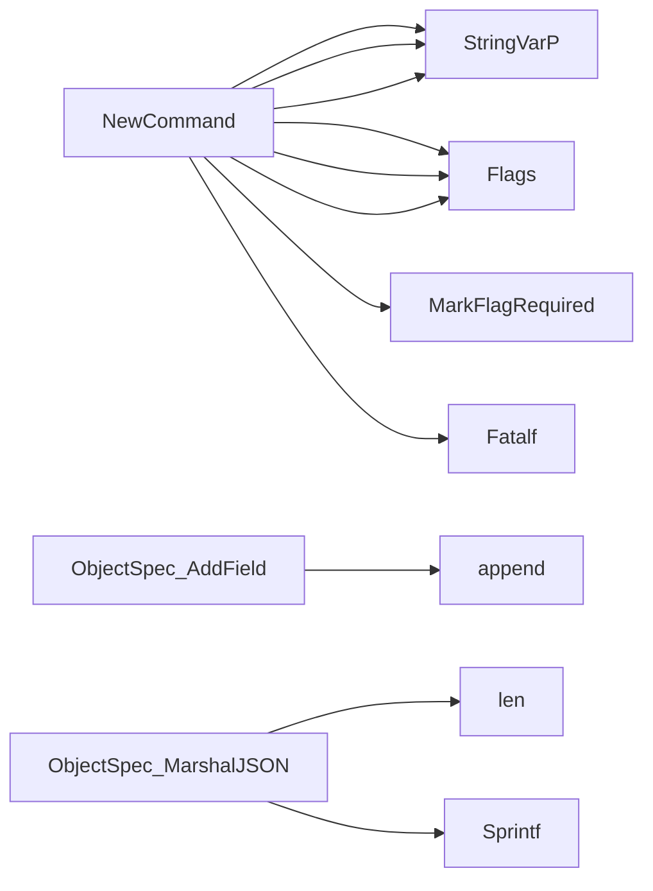

## Package failures (github.com/redhat-best-practices-for-k8s/certsuite/cmd/certsuite/claim/show/failures)

### Structs

- **FailedTestCase** (exported) — 4 fields, 0 methods
- **FailedTestSuite** (exported) — 2 fields, 0 methods
- **NonCompliantObject** (exported) — 3 fields, 0 methods
- **ObjectSpec** (exported) — 1 fields, 2 methods

### Functions

- **NewCommand** — func()(*cobra.Command)
- **ObjectSpec.AddField** — func(string, string)()
- **ObjectSpec.MarshalJSON** — func()([]byte, error)

### Globals

### Call graph (exported symbols, partial)

### Symbol docs

- [struct FailedTestCase](symbols/struct_FailedTestCase.md)
- [struct FailedTestSuite](symbols/struct_FailedTestSuite.md)
- [struct NonCompliantObject](symbols/struct_NonCompliantObject.md)
- [struct ObjectSpec](symbols/struct_ObjectSpec.md)
- [function NewCommand](symbols/function_NewCommand.md)
- [function ObjectSpec.AddField](symbols/function_ObjectSpec_AddField.md)
- [function ObjectSpec.MarshalJSON](symbols/function_ObjectSpec_MarshalJSON.md)
