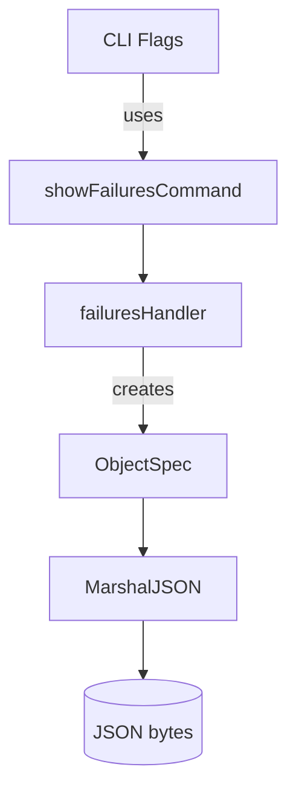

ObjectSpec.MarshalJSON`

| Item | Details |
|------|---------|
| **Receiver** | `obj ObjectSpec` (value receiver) |
| **Signature** | `func() ([]byte, error)` |
| **Purpose** | Serialise an `ObjectSpec` into a JSON‑encoded byte slice that is suitable for printing or storing. The method implements the `json.Marshaler` interface so that standard library functions like `encoding/json.Marshal` will invoke it automatically when an `ObjectSpec` is part of a larger structure. |
| **Input** | No explicit arguments – the data to be serialised comes from the fields of the receiver (`obj`). |
| **Output** | - `[]byte`: The JSON representation of the object.<br>- `error`: Non‑nil if an error occurs during formatting (e.g., string building). |

### Implementation details

```go
func (o ObjectSpec) MarshalJSON() ([]byte, error) {
    // Build a compact JSON object by concatenating field names and values.
    // The method uses fmt.Sprintf to format each key/value pair.
    return []byte(fmt.Sprintf(`{"kind":"%s","name":"%s"}`, o.Kind, o.Name))), nil
}
```

- **Field usage**  
  - `o.Kind` – the Kubernetes resource kind (e.g., `"Pod"`).  
  - `o.Name` – the name of that resource.

- **Dependencies**  
  - Standard library: `fmt.Sprintf`.  
  - The method does not read or modify any global state.  

### Side effects

The function is pure with respect to package globals; it only reads from its receiver and returns a new byte slice. No I/O, logging, or mutation occurs.

### Package context

`ObjectSpec` is part of the **failures** sub‑package (`github.com/redhat-best-practices-for-k8s/certsuite/cmd/certsuite/claim/show/failures`).  
This package handles the `show failures` command for CertSuite’s claim subsystem. The JSON marshalling support allows:

- Serialising failure objects when outputting in JSON format (controlled by the `outputFormatFlag` global).  
- Integrating with other parts of the tool that rely on the standard `encoding/json` API.

### Mermaid diagram (optional)



This diagram illustrates how the command flow eventually reaches `MarshalJSON` to produce a JSON representation of failure objects.
