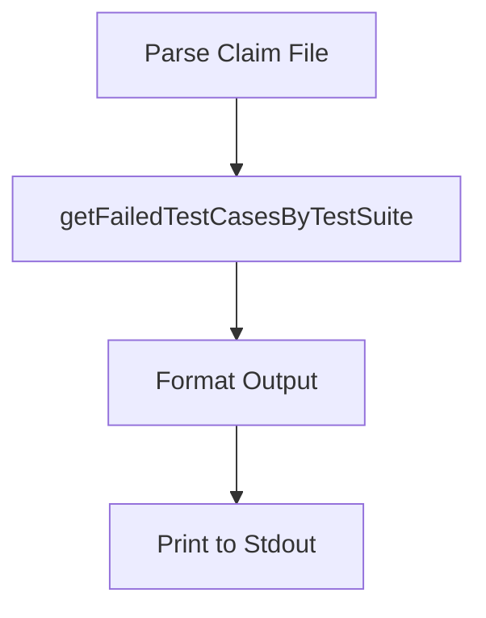

getFailedTestCasesByTestSuite`

```go
func getFailedTestCasesByTestSuite(
    claimResultsByTestSuite map[string][]*claim.TestCaseResult,
    targetTestSuites map[string]bool,
) []FailedTestSuite
```

### Purpose  
Transforms raw test‑case results extracted from a claim file into a slice of `FailedTestSuite` objects that are relevant for the current command invocation.

The function:

1. **Filters** out any test suite whose name is not present in `targetTestSuites`.  
2. For each remaining suite, it:
   * Builds a list of failing test cases (`*claim.TestCaseResult`) that have non‑zero exit codes.
   * Extracts the “non‑compliant” objects for each failure via `getNonCompliantObjectsFromFailureReason`.
3. Returns a slice of `FailedTestSuite`, where each element contains:
   * The suite name
   * The list of failing test cases for that suite

### Parameters  

| Name | Type | Description |
|------|------|-------------|
| `claimResultsByTestSuite` | `map[string][]*claim.TestCaseResult` | Mapping from test‑suite names to all their case results parsed from the claim file. |
| `targetTestSuites` | `map[string]bool` | Set of suite names that should be considered (derived from command line flags). |

### Return Value  

- `[]FailedTestSuite`: Ordered slice of failing suites, each with its own list of failed test cases.

### Key Dependencies  

* **`claim.TestCaseResult`** – the structure representing a single test case’s outcome.  
* **`getNonCompliantObjectsFromFailureReason`** – helper that extracts non‑compliant object identifiers from a failure reason string.
* Standard library functions: `append`, `len`, and `fmt.Fprintf`.

### Side Effects  

None on global state; the function only reads its inputs and constructs new data structures. It writes to the `outputFormatFlag`? *No* – it merely prepares data for later formatting/printing.

### Role in the Package  

Within `github.com/redhat-best-practices-for-k8s/certsuite/cmd/certsuite/claim/show/failures`, this helper is invoked by the command handler after claim files have been parsed. It isolates the logic of *filtering and organizing failures* so that other parts of the command can focus on formatting (text or JSON) and printing.



---

**TL;DR:**  
`getFailedTestCasesByTestSuite` takes parsed claim results and a set of user‑selected test suites, filters out irrelevant suites, extracts failing cases per suite, and returns that structured data ready for display.
