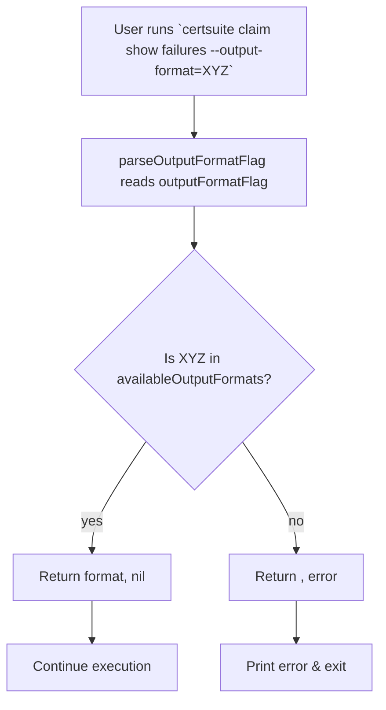

parseOutputFormatFlag`

```go
func parseOutputFormatFlag() (string, error)
```

### Purpose  
`parseOutputFormatFlag` validates the value supplied to the `--output-format` flag when running the **show failures** sub‑command of Certsuite’s claim CLI.  
It ensures that the chosen format is one of the supported output styles defined in `availableOutputFormats`.  If the user passes an unsupported string, the function returns an error with a clear message.

### Inputs & Outputs
| Parameter | Type | Description |
|-----------|------|-------------|
| *none* | — | The function reads the global variable `outputFormatFlag`, which is set by the CLI flag parser. |

| Return value | Type | Description |
|--------------|------|-------------|
| `string` | the validated format (e.g., `"text"`, `"json"`). |
| `error` | non‑nil if `outputFormatFlag` is not in `availableOutputFormats`; otherwise `nil`. |

### Key Dependencies
- **Globals**
  - `outputFormatFlag`: holds the raw flag value.
  - `availableOutputFormats`: slice of supported format strings (`["text", "json"]`).
- **Standard library**
  - `fmt.Errorf` for error construction.

### Side Effects
None. The function is pure: it only reads globals and returns values; no state mutation occurs.

### Package Context
The `failures` package implements the `certsuite claim show failures` command, which prints test‑failure details from a claim file.  
This helper validates user input before the command proceeds to read the claim file (`claimFilePathFlag`) or filter by test suites (`testSuitesFlag`).  It is called early in the command’s execution flow; failure to validate halts the command with an informative error message.

### Suggested Mermaid Diagram


This function is a small but essential guard that ensures downstream code receives a valid format string, keeping the rest of the command’s logic straightforward.
