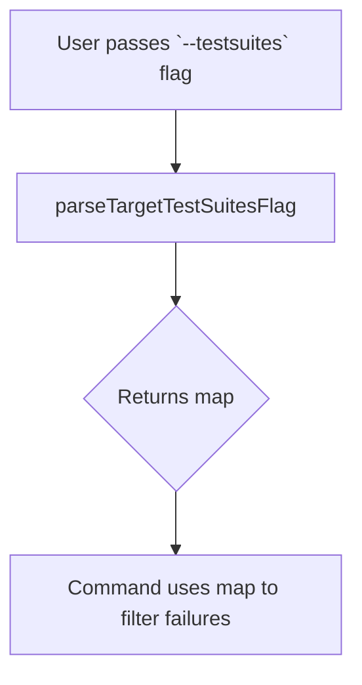

parseTargetTestSuitesFlag`

### Purpose
`parseTargetTestSuitesFlag` transforms the command‑line flag value supplied to **`testSuitesFlag`** (a comma‑separated string of test‑suite names) into a lookup map.

The returned map has:

| Key | Value |
|-----|-------|
| Test‑suite name | `true` |

This structure allows other parts of the *show failures* command to quickly determine whether a given suite should be processed.

### Signature
```go
func parseTargetTestSuitesFlag() map[string]bool
```

No parameters are passed; the function reads the global variable `testSuitesFlag`.

### Key Dependencies

| Dependency | Role |
|------------|------|
| `strings.Split` | Splits the raw flag string on commas. |
| `strings.TrimSpace` | Cleans each split token of surrounding whitespace. |

The function does not interact with any external packages or global state beyond reading `testSuitesFlag`.

### Side‑Effects
- None. The function is purely functional; it returns a new map and leaves all globals untouched.

### How It Fits the Package

*Package:* `github.com/redhat-best-practices-for-k8s/certsuite/cmd/certsuite/claim/show/failures`

The *show failures* command accepts an optional `--testsuites` flag.  
`parseTargetTestSuitesFlag` is called during command execution to:

1. Parse that flag into a set of suite names.
2. Provide fast membership checks for filtering failures when displaying results.

By returning a map, the rest of the command can perform O(1) lookups instead of iterating over a slice each time it needs to decide whether to show a particular test failure.

### Example Usage

```go
// Assume user ran: certsuite claim show failures --testsuites="SuiteA,SuiteB"
suites := parseTargetTestSuitesFlag()
if suites["SuiteA"] {
    // process failures for SuiteA
}
```

---

**Mermaid diagram (optional)**


