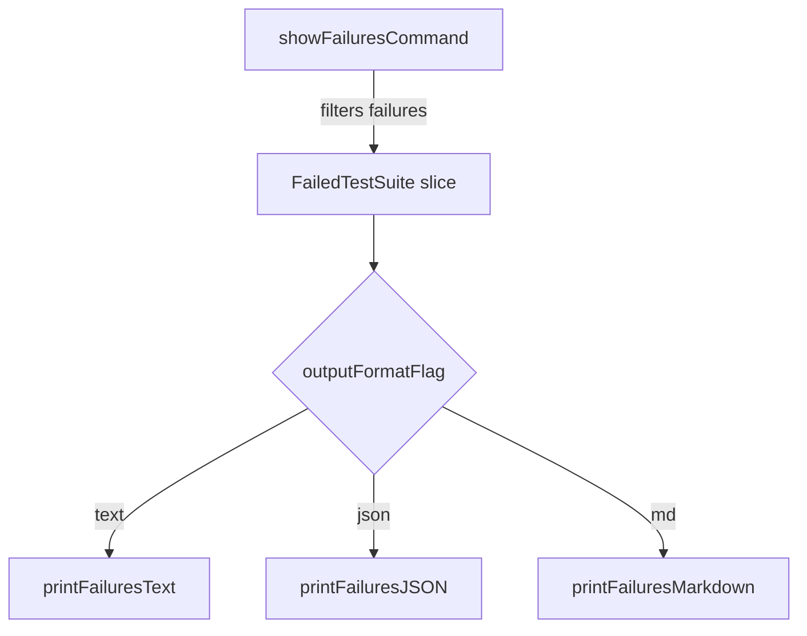

printFailuresText`

| Attribute | Value |
|-----------|-------|
| **Package** | `github.com/redhat-best-practices-for-k8s/certsuite/cmd/certsuite/claim/show/failures` |
| **Signature** | `func printFailuresText([]FailedTestSuite)` |
| **Visibility** | unexported (internal helper) |

### Purpose
`printFailuresText` renders a list of test‑suite failures to the console in a human‑readable, plain‑text format.  
It is used by the *show failures* command when the user selects the `--output=text` flag.

### Parameters

| Name | Type | Description |
|------|------|-------------|
| `failedSuites []FailedTestSuite` | slice of `FailedTestSuite` | A collection of test suites that contain at least one failed test. The function iterates over this slice to produce the output. |

> **Note**: `FailedTestSuite` is defined elsewhere in the package and contains fields such as `Name`, `Tests` (slice of `FailedTest`) and metadata used for formatting.

### Return Value
None – the function writes directly to standard output via `fmt.Printf`. It does not return a value or error; failures are always printed.

### Key Dependencies

| Dependency | Role |
|------------|------|
| `fmt.Printf` | Core printing mechanism. Used repeatedly to format suite names, test counts, and individual failure messages. |
| `len()` | Determines how many suites are being processed for formatting purposes (e.g., to add separators). |

The function does **not** depend on any global variables or configuration flags directly; it receives all needed data through its argument.

### Side Effects

* Prints to `stdout` in a structured, indented format.
* No modification of the input slice or other package state.
* No errors are returned – if printing fails (e.g., due to I/O error), Go’s standard library will handle it silently (printing may be incomplete).

### How It Fits the Package

1. **Command Flow**  
   * The `showFailuresCommand` parses CLI flags (`--claim`, `--testsuites`, `--output`).  
   * After loading the claim file, it filters test suites based on the `--testsuites` flag and identifies failures.  
   * Depending on `--output`, it calls one of three rendering functions:  
     - `printFailuresText` (plain text)  
     - `printFailuresJSON` (JSON serialization)  
     - `printFailuresMarkdown` (markdown).  

2. **Separation of Concerns**  
   * The command logic is responsible for data gathering and flag handling.  
   * Rendering functions like `printFailuresText` are pure output helpers, making the codebase easier to maintain and test.

### Suggested Mermaid Diagram

This diagram shows the decision path from command execution to the appropriate output routine, highlighting where `printFailuresText` fits.
