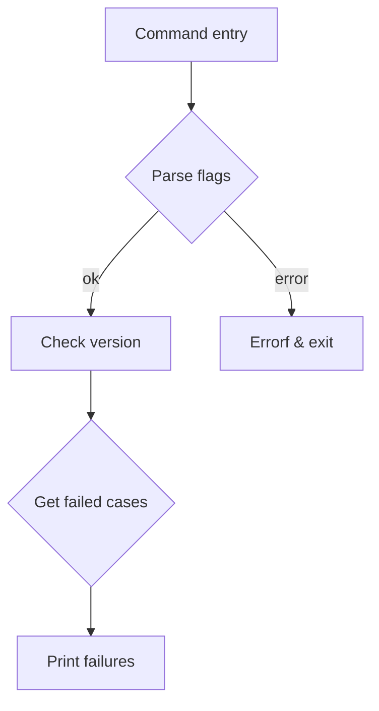

showFailures` – Core logic for the `certsuite claim show failures` command  

| Item | Detail |
|------|--------|
| **Location** | `cmd/certsuite/claim/show/failures/failures.go:281` |
| **Signature** | `func (*cobra.Command, []string) error` |
| **Purpose** | Executes the *show failures* sub‑command. It reads a claim file, filters by user‑supplied test suites (if any), collects all failed test cases and prints them in the requested format (`text`, `json` or an error if the format is unknown). |

### High‑level workflow



1. **Flag parsing**  
   * `parseOutputFormatFlag` – validates the value of `--output-format`.  
   * `parseTargetTestSuitesFlag` – splits the comma‑separated list from `--test-suites` into a slice.

2. **Version check** – `CheckVersion` ensures that the claim file matches the expected schema version.

3. **Claim parsing** – `Parse(claimFilePath)` loads the JSON/YAML claim and returns a structured object.

4. **Filtering failed test cases**  
   * `getFailedTestCasesByTestSuite(parsedClaim, targetSuites)` walks the claim’s test‑suite tree, collecting only those test cases whose status is *failed*.  
   * If no suites are specified (`targetSuites` empty), all failures from every suite are returned.

5. **Output** – depending on `outputFormatFlag`:  

| Format | Function called |
|--------|-----------------|
| `text` | `printFailuresText` |
| `json` | `printFailuresJSON` |
| unknown | error via `Errorf` with message `outputFarmatInvalid` |

6. **Return value** – The function returns an `error` only if something goes wrong during parsing, version checking or output formatting; otherwise it returns `nil`.

### Key dependencies

| Dependency | Role |
|------------|------|
| `cobra.Command` | Provides command context (used for flag extraction). |
| `parseOutputFormatFlag`, `parseTargetTestSuitesFlag` | Helper functions that read and validate CLI flags. |
| `CheckVersion` | Validates claim file version before processing. |
| `Parse` | Deserialises the claim file into a Go struct. |
| `getFailedTestCasesByTestSuite` | Filters failures from parsed claim. |
| `printFailuresJSON`, `printFailuresText` | Render the failure list in the requested format. |

### Side effects

* Reads a file whose path is supplied via the global flag `claimFilePathFlag`.  
* Prints to standard output (either plain text or JSON).  
* No modifications are made to the claim data or filesystem.

### Relationship within the package

The `failures` package implements the *show failures* sub‑command of the larger `certsuite claim show` command tree. The function is wired into Cobra during initialization:

```go
var showFailuresCommand = &cobra.Command{
    Use:   "failures",
    Short: "Show all failed test cases in a claim file",
    RunE:  showFailures,
}
```

Thus, `showFailures` serves as the entry point that ties together flag parsing, claim validation, failure extraction, and output rendering for this particular CLI operation.
