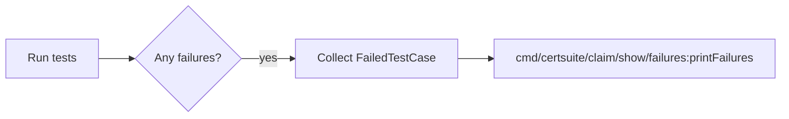

FailedTestCase`

`FailedTestCase` is a plain data holder used by the **show failures** command to
present information about a test case that did not pass.

| Field | Type | Purpose |
|-------|------|---------|
| `TestCaseName` | `string` | Human‑readable identifier of the test case.  Used as the key when the output is grouped or indexed. |
| `TestCaseDescription` | `string` | Optional long description that explains what the test checks for.  Helpful for users who want to understand why a failure occurred. |
| `CheckDetails` | `string` | A free‑form explanation produced by the underlying test framework (e.g., a log snippet or assertion message).  It gives context about the specific condition that failed. |
| `NonCompliantObjects` | `[]NonCompliantObject` | Slice of objects that caused the failure. Each element contains details such as the Kubernetes resource name, namespace, and why it was deemed non‑compliant. The type `NonCompliantObject` is defined in the same package (see `types.go`). |

### Dependencies

* **`NonCompliantObject`** – a struct that captures the identity of a
  failing Kubernetes object and its compliance reason.
* No other external packages are referenced directly by this struct.

### Usage Flow

1. The test runner identifies a failing case and creates a `FailedTestCase` instance, populating all fields.
2. Instances are accumulated (often in a slice) by the command’s logic.
3. When rendering the output (`show failures`), each `FailedTestCase` is printed with its name, description, check details, and list of non‑compliant objects.

### Side Effects & Constraints

* The struct has **no methods**, so it does not alter state beyond what is stored in its fields.
* All fields are exported; consumers can freely marshal the struct to JSON/YAML or display it as plain text.
* Because `NonCompliantObjects` is a slice, callers must be careful with nil vs. empty slices when serializing.

### Where It Fits

Within the `certsuite/cmd/certsuite/claim/show/failures` package,
`FailedTestCase` acts as the *model* that bridges raw test failures and
the user‑facing report.  The command’s logic focuses on collecting these models,
filtering by namespace or claim, and formatting them for display.
This struct is intentionally lightweight to keep rendering code simple and
decoupled from the underlying test engine.
