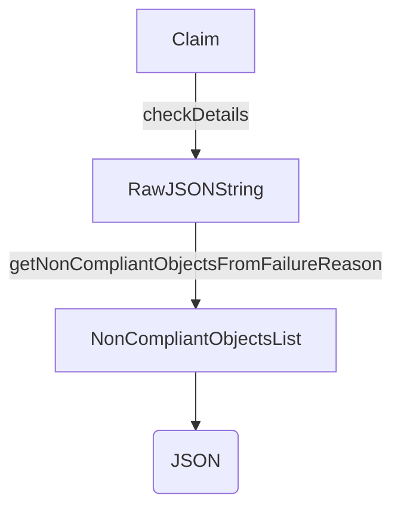

NonCompliantObject` – Custom JSON representation of a failing claim

| Feature | Description |
|---------|-------------|
| **Package** | `github.com/redhat-best-practices-for-k8s/certsuite/cmd/certsuite/claim/show/failures` |
| **Purpose** | Represents an object that failed validation in a certsuite claim. The struct is deliberately *different* from the raw `skipReason` field found inside a test case’s `checkDetails`.  It exists so that the CLI can output a clean, stable JSON format for downstream tooling or reporting. |
| **Fields** | <ul><li>`Reason string` – human‑readable description of why the object is non‑compliant.</li> <li>`Spec ObjectSpec` – the actual Kubernetes manifest (or subset) that caused the failure. The `ObjectSpec` type is defined elsewhere in the same package and mirrors the shape of a generic resource specification.</li> <li>`Type string` – the kind of Kubernetes object (`Deployment`, `Service`, etc.).</li></ul> |
| **JSON mapping** | When marshalled to JSON the struct fields are exported as `reason`, `spec`, and `type`.  This differs from the original `skipReason` field, which may contain a nested map or other structure.  The conversion is performed by `getNonCompliantObjectsFromFailureReason`. |
| **Dependencies** | *`ObjectSpec`* – imported from the same package; it contains all fields that can appear in a Kubernetes spec (e.g., `metadata`, `spec`).<br>*`encoding/json`* – used internally to unmarshal the raw failure reason into a map, then re‑marshall into this struct. |
| **Side effects** | None beyond returning data. The function may return an error if the input string cannot be unmarshalled or is empty. |
| **How it fits the package** | `NonCompliantObject` is used by the CLI’s *show failures* command to build a list of all objects that caused a claim to fail.  The resulting slice (`[]NonCompliantObject`) is printed as JSON, enabling consumers (e.g., CI pipelines) to programmatically inspect which resources violated policy. |


### Usage flow

```go
// rawReason comes from the claim's test case checkDetails field
rawReason := "..."
objs, err := getNonCompliantObjectsFromFailureReason(rawReason)
if err != nil {
    // handle error
}
jsonOutput, _ := json.MarshalIndent(objs, "", "  ")
fmt.Println(string(jsonOutput))
```

`getNonCompliantObjectsFromFailureReason` parses the raw JSON string into a map, extracts each offending object’s type and spec, and constructs `NonCompliantObject` instances. The result is a clean, flat representation suitable for downstream consumption.

---

#### Mermaid diagram (suggested)



This illustrates how a claim’s failure reason is transformed into the `NonCompliantObject` slice that the CLI ultimately prints.
