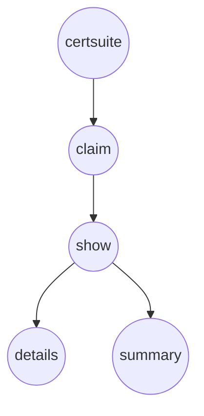

NewCommand` – *CLI “show” sub‑command builder*

| Element | Detail |
|---------|--------|
| **Location** | `cmd/certsuite/claim/show/show.go:16` |
| **Signature** | `func NewCommand() *cobra.Command` |
| **Exported** | Yes |

### Purpose
`NewCommand` constructs the root command for the `show` feature of CertSuite.  
The `show` command is a sub‑command under the top‑level `claim` command and provides
runtime behaviour for displaying information about claims. The function returns a fully configured `*cobra.Command`
instance ready to be added to the parent command tree.

### Inputs / Outputs
| Parameter | Type | Notes |
|-----------|------|-------|
| None | – | This factory takes no arguments; it relies on package‑level state (`showCommand`). |

**Return value**

- `*cobra.Command`: a pointer to the Cobra command that represents the `show` sub‑command.  
  The returned command includes its own usage string, help text, and any child commands added by this function.

### Key Dependencies
1. **Cobra library** – the command is built using `github.com/spf13/cobra`.  
2. **Package‑level variable `showCommand`** – the function assigns to or reuses this global variable to store the created command.
3. **Other sub‑commands** – the function repeatedly calls `AddCommand(NewCommand())`, effectively registering nested commands such as `details`, `summary`, etc., each of which is defined in separate files within the same package.

### Side Effects
- **State mutation**: The global `showCommand` variable is set (or overwritten) when this function runs.
- **Recursive registration**: By calling `NewCommand()` inside itself, it recursively adds sub‑commands until the recursion base case (no further sub‑commands) is reached. This pattern ensures that all nested commands are wired into the command tree.

### Package Context
The `show` package lives under `cmd/certsuite/claim/show`.  
Its parent hierarchy is:

```
certsuite          // root binary
└── claim          // main feature group
    └── show      // sub‑feature for displaying claims
```

`NewCommand` is the entry point that external callers (e.g., `cmd/certsuite/main.go`) use to attach the `show` command tree to the CLI.  
Other commands in the package (`details`, `summary`, etc.) are defined similarly and are registered via this function, keeping the package modular and testable.

### Suggested Diagram


This diagram visualises the command hierarchy that `NewCommand` helps build.
