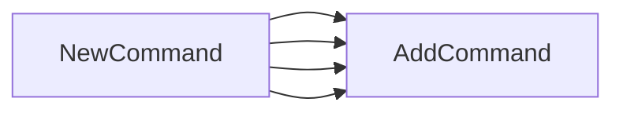

## Package generate (github.com/redhat-best-practices-for-k8s/certsuite/cmd/certsuite/generate)

## Overview – `cmd/certsuite/generate`

The **generate** package is the entry point for the *`certsuite generate`* CLI command group.  
It wires together several sub‑command modules (catalog, config, feedback, qe_coverage) into a single Cobra command tree that is exposed by the top‑level CertSuite binary.

| Element | Details |
|---------|---------|
| **Package path** | `github.com/redhat-best-practices-for-k8s/certsuite/cmd/certsuite/generate` |
| **Purpose** | Assemble and expose all generation‑related sub‑commands for the CertSuite tool. |
| **Global variables** | `generate` – a placeholder variable that is never read; likely left for future use or to satisfy linter rules. |

### Key Function: `NewCommand()`

```go
func NewCommand() *cobra.Command
```

* Builds a root `*cobra.Command` named `"generate"`.  
* Calls `AddCommand` repeatedly, each time attaching the result of another package’s `NewCommand()` function:
  * `catalog.NewCommand()`
  * `config.NewCommand()`
  * `feedback.NewCommand()`
  * `qe_coverage.NewCommand()`

The repeated pattern indicates that every sub‑module defines its own command hierarchy (flags, arguments, run logic) and returns it via a public `NewCommand` function. The root command simply aggregates them.

#### Flow

```mermaid
flowchart TD
    A[generate.NewCommand()] --> B{Create cobra.Command "generate"}
    B --> C[catalog.NewCommand()]
    B --> D[config.NewCommand()]
    B --> E[feedback.NewCommand()]
    B --> F[qe_coverage.NewCommand()]
```

### How It Connects

1. **Top‑level CLI** (`certsuite`) imports `cmd/certsuite/generate` and registers the returned command with Cobra’s root command.
2. When a user runs `certsuite generate <subcommand>`, the appropriate sub‑module handles execution.
3. Each sub‑module may further expose its own nested commands (e.g., `generate catalog add`, `generate config list`, etc.).

### Summary

* The **generate** package is a thin orchestration layer that bundles together four distinct command trees under the `generate` namespace.  
* No complex data structures or state are involved; the focus is on composition of Cobra commands.  
* Future extensions could populate the unused `generate` variable or add additional sub‑commands following the same pattern.

### Functions

- **NewCommand** — func()(*cobra.Command)

### Globals


### Call graph (exported symbols, partial)



### Symbol docs

- [function NewCommand](symbols/function_NewCommand.md)
