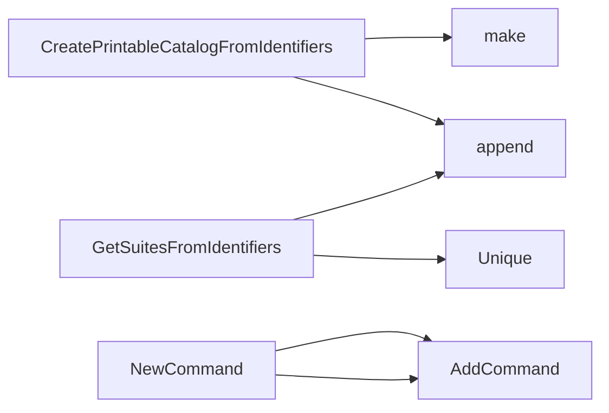

## Package catalog (github.com/redhat-best-practices-for-k8s/certsuite/cmd/certsuite/generate/catalog)

# 📦 `catalog` – Generating a Markdown Test Catalog

The **`catalog`** package is part of the Certsuite command‑line tool (`cmd/certsuite/generate/catalog`).  
Its job is to walk through all available test cases (both certsuite and preflight tests), organize them by *suite* and *scenario*, compute some statistics, and finally emit a human‑readable Markdown file that can be dropped into the Certsuite documentation.

Below you’ll find a concise, structured view of the key pieces:

| Layer | What it is | How it’s used |
|-------|------------|---------------|
| **Data structures** | `Entry` – one test case (`claim.Identifier`) with its name.<br>`catalogSummary` – aggregated counts for the generated catalog. | Build the printable catalogue, keep per‑suite & per‑scenario totals. |
| **Globals** | `generateCmd`, `markdownGenerateClassification`, `markdownGenerateCmd` – Cobra command plumbing that wires everything together. | Exposed via `NewCommand()` to be added to the main Certsuite CLI. |
| **Core functions** | `CreatePrintableCatalogFromIdentifiers`<br>`GetSuitesFromIdentifiers`<br>`outputTestCases`<br>`summaryToMD`<br>… | Transform raw identifiers → printable list, compute stats, format Markdown. |

---

## 📄 Data Structures

### 1. `Entry`

```go
type Entry struct {
    identifier claim.Identifier // full URL + version of the test case
    testName   string           // human‑readable name extracted from the URL
}
```

*Used by:*  
`outputTestCases()` builds a map `map[string][]Entry`, keyed by suite name, to generate Markdown tables.

### 2. `catalogSummary`

```go
type catalogSummary struct {
    testPerScenario map[string]map[string]int // scenario → suite → count
    testsPerSuite   map[string]int            // suite → total tests
    totalSuites     int                       // number of distinct suites
    totalTests      int                       // overall test count
}
```

*Used by:*  
`summaryToMD()` turns this struct into a Markdown summary block that appears at the end of `CATALOG.md`.

---

## 🔗 Core Workflow

Below is a high‑level flow, with **Mermaid** suggestion for visualization.

```mermaid
graph TD
  A[Generate CLI invoked] --> B[NewCommand()]
  B --> C{markdownGenerateCmd}
  C --> D[runGenerateMarkdownCmd]
  D --> E[outputIntro]
  D --> F[outputTestCases]
  F --> G[CreatePrintableCatalogFromIdentifiers]
  G --> H[GetSuitesFromIdentifiers]
  D --> I[summaryToMD]   % uses catalogSummary
  I --> J[Print summary block]
```

1. **CLI Entry Point** – `NewCommand()` creates a Cobra command (`markdownGenerateCmd`) and registers it under the `generate` root command.
2. **Running the Command** – The user runs something like:
   ```bash
   certsuite generate catalog markdown
   ```
3. **Generating Markdown** – `runGenerateMarkdownCmd` orchestrates everything:
   * Prints an introductory block (`outputIntro()`).
   * Calls `outputTestCases()` to list every test case in a table.
   * Appends a summary table produced by `summaryToMD()`.
   * Adds SCC categories via `outputSccCategories()`.

---

## 📦 Key Functions

| Function | Purpose | Highlights |
|----------|---------|------------|
| **`CreatePrintableCatalogFromIdentifiers([]claim.Identifier)`** | Parses each identifier URL to extract suite & test name, returning a map of suites → list of `Entry`. | Uses string manipulation (splitting on `/`) and simple appends. |
| **`GetSuitesFromIdentifiers([]claim.Identifier)`** | Returns the distinct suite names from a set of identifiers. | Utilises an `Unique()` helper to de‑duplicate. |
| **`addPreflightTestsToCatalog()`** | *Internal* helper that adds OpenShift Preflight test cases to the catalog (via the Preflight API). | Currently a placeholder (`TODO`) – not fully implemented in this snippet. |
| **`outputTestCases() (string, catalogSummary)`** | Builds Markdown for all test cases and returns both the rendered text and a `catalogSummary`. | Handles formatting of tables, scenario mapping, and stats collection. |
| **`summaryToMD(catalogSummary) string`** | Turns the summary struct into a Markdown section. | Produces a table with total suites/tests and per‑scenario counts. |
| **`runGenerateMarkdownCmd(*cobra.Command, []string)`** | Cobra `RunE` callback for the markdown command. | Calls all output helpers and writes to stdout via `Fprintf`. |

---

## 📑 Markdown Output

The final file (`CATALOG.md`) looks roughly like:

```
# Certsuite Test Catalog

<intro block>

## Test Cases
| Suite | Test | Scenario |
|-------|------|----------|
| foo   | bar  | foo-bar  |
...

<!-- Summary -->
### Summary
| Total Suites | Total Tests |
|--------------|-------------|
| 12           | 456         |

### By Scenario
| Scenario | Count |
|----------|-------|
| foo-bar  | 34    |
...
```

The `outputIntro()`, `outputSccCategories()` and `scenarioIDToText()` helpers inject the static text, SCC category list, and human‑friendly scenario names respectively.

---

## 📚 Summary

- **Data flow**: Identifiers → printable map (`Entry`) → Markdown tables + summary.
- **Key data structures**: `Entry` for individual tests, `catalogSummary` for aggregated stats.
- **Command plumbing**: `NewCommand()` exposes a Cobra command that triggers the entire generation pipeline.
- **Extensibility**: The design isolates formatting helpers, making it easy to add new sections or change Markdown layout.

This overview should give you a solid grasp of how the `catalog` package assembles and emits a test catalog for Certsuite.

### Structs

- **Entry** (exported) — 2 fields, 0 methods
- **catalogSummary**  — 4 fields, 0 methods

### Functions

- **CreatePrintableCatalogFromIdentifiers** — func([]claim.Identifier)(map[string][]Entry)
- **GetSuitesFromIdentifiers** — func([]claim.Identifier)([]string)
- **NewCommand** — func()(*cobra.Command)

### Globals


### Call graph (exported symbols, partial)



### Symbol docs

- [struct Entry](symbols/struct_Entry.md)
- [function CreatePrintableCatalogFromIdentifiers](symbols/function_CreatePrintableCatalogFromIdentifiers.md)
- [function GetSuitesFromIdentifiers](symbols/function_GetSuitesFromIdentifiers.md)
- [function NewCommand](symbols/function_NewCommand.md)
