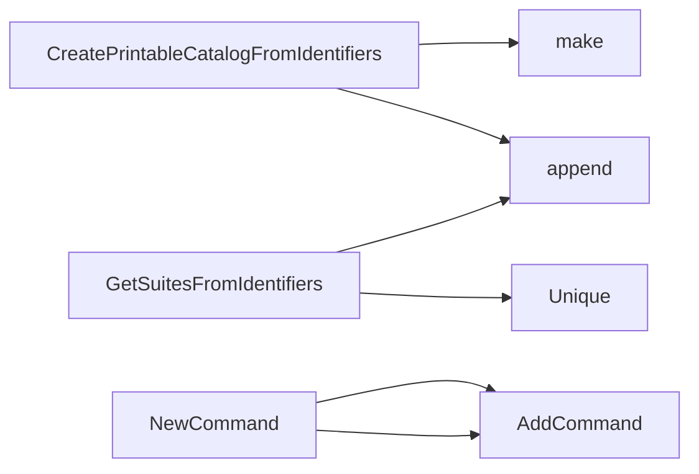

## Package catalog (github.com/redhat-best-practices-for-k8s/certsuite/cmd/certsuite/generate/catalog)

### Structs

- **Entry** (exported) — 2 fields, 0 methods
- **catalogSummary**  — 4 fields, 0 methods

### Functions

- **CreatePrintableCatalogFromIdentifiers** — func([]claim.Identifier)(map[string][]Entry)
- **GetSuitesFromIdentifiers** — func([]claim.Identifier)([]string)
- **NewCommand** — func()(*cobra.Command)

### Globals

### Call graph (exported symbols, partial)

### Symbol docs

- [struct Entry](symbols/struct_Entry.md)
- [function CreatePrintableCatalogFromIdentifiers](symbols/function_CreatePrintableCatalogFromIdentifiers.md)
- [function GetSuitesFromIdentifiers](symbols/function_GetSuitesFromIdentifiers.md)
- [function NewCommand](symbols/function_NewCommand.md)
