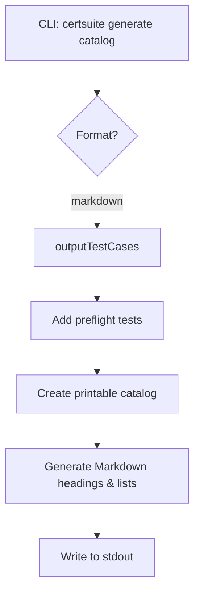

outputTestCases`

**Purpose**

`outputTestCases` builds a Markdown representation of the test‑case catalog and writes it to standard output.  
It is invoked by the `generate catalog` command when the user selects *markdown* as the output format.

The function returns two values:

| Return value | Type           | Meaning                                                                 |
|--------------|----------------|-------------------------------------------------------------------------|
| `string`     | Markdown text  | The full Markdown document that will be printed to stdout.              |
| `catalogSummary` | struct (not shown) | Summary information about the catalog that is used elsewhere in the CLI. |

> **Note** – The actual type of `catalogSummary` is defined elsewhere in the package; it contains metrics such as the number of suites, tests, and total scenarios.

---

### Workflow

1. **Pre‑flight test addition**  
   Calls `addPreflightTestsToCatalog()` to ensure that all required pre‑flight checks are present in the catalog.

2. **Build printable catalog**  
   - Calls `CreatePrintableCatalogFromIdentifiers` with identifiers obtained from `GetSuitesFromIdentifiers`.  
   - The resulting slice contains only the data needed for Markdown output (no internal IDs, just readable names).

3. **Generate markdown header**  
   ```go
   fmt.Printf("# Test Cases\n\n")
   ```
   The first line is a top‑level heading.

4. **Iterate suites & scenarios**  
   For each suite in the printable catalog:
   - Write the suite name as a second‑level heading (`## SuiteName`).
   - Iterate over its scenarios, converting scenario IDs to human‑readable text via `scenarioIDToText`.
   - Each scenario is rendered as a bullet list item with a link placeholder (e.g., `[Scenario](/path)`).

5. **Formatting helpers**  
   The function uses standard library helpers:
   - `strings.ReplaceAll` / `strings.ToLower` for normalising text.
   - `fmt.Sprintf` to format Markdown links and headings.
   - `strings.Contains` to filter out unwanted scenarios (e.g., those that do not belong to the current classification).

6. **Error handling**  
   If any step fails (e.g., an identifier cannot be resolved), the function prints an error via `log.Printf`, calls `os.Exit(1)`, and never returns a value.

---

### Key Dependencies

| Dependency | Role |
|-------------|------|
| `addPreflightTestsToCatalog` | Populates catalog with pre‑flight tests. |
| `CreatePrintableCatalogFromIdentifiers` | Produces a lightweight representation suitable for Markdown. |
| `GetSuitesFromIdentifiers` | Provides the list of suite identifiers to include. |
| `scenarioIDToText` | Converts internal scenario IDs into readable labels. |
| Standard libraries (`fmt`, `strings`, `os`) | Formatting, string manipulation, and error handling. |

---

### Side‑Effects

* **stdout** – The Markdown document is written directly to standard output.
* **process exit** – On error the function terminates the program with `os.Exit(1)`.
* **no mutation of globals** – It does not modify any package‑level variables; all data are read‑only.

---

### Integration in the Package

`outputTestCases` is called by the `markdownGenerateCmd` command handler.  
When a user runs:

```bash
certsuite generate catalog --format markdown
```

the CLI will invoke this function to produce a ready‑to‑publish Markdown file that lists all test cases grouped by suite.

---

### Suggested Mermaid Diagram



This diagram visualises how the function fits into the overall command flow.
