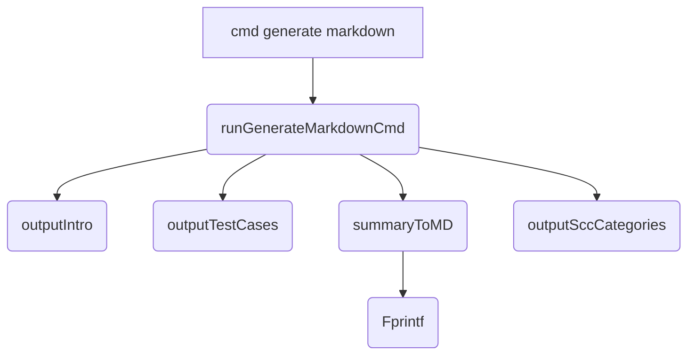

runGenerateMarkdownCmd`

| Item | Detail |
|------|--------|
| **Signature** | `func runGenerateMarkdownCmd(cmd *cobra.Command, args []string) error` |
| **Package** | `github.com/redhat-best-practices-for-k8s/certsuite/cmd/certsuite/generate/catalog` |
| **Purpose** | Implements the command that writes a markdown‑formatted catalog of test cases to the console (or a file). The function is wired to the *cobra* CLI as the handler for the `generate markdown` sub‑command. |

### How it works

```text
1. outputIntro()          → prints introductory section of the markdown.
2. outputTestCases()      → lists all test cases in markdown format.
3. summaryToMD()          → converts a test summary to markdown and writes it via fmt.Fprintf.
4. outputSccCategories()  → adds SCC‑specific categories to the document.
5. (implicit) return nil   → signals successful execution.
```

The function is intentionally minimal: it orchestrates a sequence of helper functions that each write directly to `cmd.OutOrStdout()` (the command’s standard output). There are no state changes or global variable modifications; all side‑effects are confined to the output stream.

### Inputs

| Parameter | Type | Description |
|-----------|------|-------------|
| `cmd` | `*cobra.Command` | The *cobra* command instance. Used to obtain the output writer via `OutOrStdout()`. |
| `args` | `[]string` | Positional arguments supplied by the user. This function does not consume any; the slice is ignored. |

### Outputs

- **Return value**: `error`
  - The function always returns `nil`; it never signals an error condition because all helper functions are designed to write without returning errors. If a future change introduces error handling, this return value would propagate that.

### Dependencies & Side Effects

| Dependency | Role |
|------------|------|
| `outputIntro` | Writes the opening section of the markdown catalog. |
| `outputTestCases` | Emits the list of test cases in markdown form. |
| `summaryToMD` | Formats a summary object into markdown and writes it via `fmt.Fprintf`. |
| `outputSccCategories` | Adds SCC‑related categories to the document. |
| `fmt.Fprintf` (aliased as `Fprintf`) | Low‑level writer used by `summaryToMD`. |

All dependencies write directly to the command’s output; no other global state is read or modified.

### Integration in the package

- The **catalog** command set exposes a `generate` parent with sub‑commands.  
  - `markdownGenerateCmd` (declared at line 55) registers this function as its `RunE` handler.
  - When a user runs:

    ```bash
    certsuite generate markdown
    ```

    the *cobra* framework invokes `runGenerateMarkdownCmd`, which in turn calls the four helper functions to produce a complete markdown document describing all tests.

- The command’s output is meant for consumption by humans or tooling that can parse markdown (e.g., static site generators, documentation portals).

### Suggested Mermaid diagram



This diagram illustrates the linear flow of output generation within `runGenerateMarkdownCmd`.
