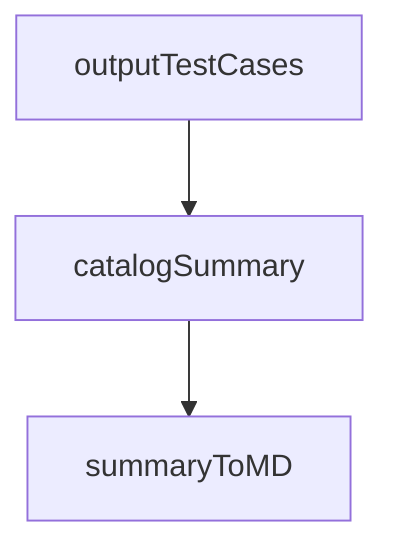

catalogSummary` – Internal statistics container

| Field | Type | Meaning |
|-------|------|---------|
| `testPerScenario` | `map[string]map[string]int` | Maps a *scenario ID* → map of *test name* → number of times the test appears in that scenario.  Used to build per‑scenario tables in the Markdown output. |
| `testsPerSuite` | `map[string]int` | Maps a *suite name* → total number of tests in that suite.  Drives the overall “# of tests” column in the summary table. |
| `totalSuites` | `int` | Number of unique test suites discovered while walking the catalog. |
| `totalTests` | `int` | Total count of all tests across all scenarios and suites (i.e., sum of all values in `testsPerScenario`). |

### Purpose

The struct is a **read‑only data holder** used during the generation of Markdown documentation for the Certsuite test catalog.  
- It aggregates statistics while walking the catalog tree (`outputTestCases` builds it).  
- It is then consumed by `summaryToMD` to produce a concise summary table.

### How it fits in the package

1. **Population** – In `outputTestCases`, as each scenario is processed, counters are incremented and stored in the maps above.
2. **Consumption** – After all scenarios have been traversed, `summaryToMD(catalogSummary)` formats the aggregated data into Markdown.

### Key dependencies & side effects

| Dependency | Interaction |
|------------|-------------|
| `catalog` (internal package) | Provides the catalog structure; traversal functions fill `catalogSummary`. |
| `fmt.Sprint*`, `strings.*` | Used by `summaryToMD` to build the Markdown strings; no state is mutated. |
| No global state | All data lives inside a single `catalogSummary` instance passed by value. |

### Mermaid diagram (optional)

The diagram shows the flow: `outputTestCases` populates `catalogSummary`, which is then fed into `summaryToMD`.

---

**Bottom line:**  
`catalogSummary` is a lightweight, self‑contained snapshot of catalog statistics that bridges the traversal logic (`outputTestCases`) and the Markdown rendering logic (`summaryToMD`). No external side effects; all data is computed locally and returned for formatting.
