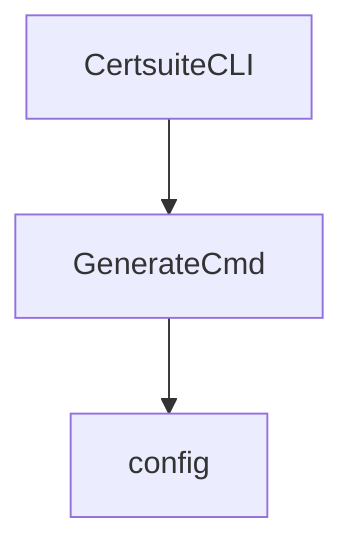

NewCommand` – CLI configuration entry point

| Item | Details |
|------|---------|
| **Package** | `github.com/redhat-best-practices-for-k8s/certsuite/cmd/certsuite/generate/config` |
| **Signature** | `func NewCommand() *cobra.Command` |
| **Exported** | ✅ |

## Purpose

`NewCommand` constructs the root configuration command that is embedded in the larger Certsuite CLI.  
The command exposes sub‑commands and flags for generating a configuration file (`certsuite.yaml`) that drives the rest of the tool.

It is invoked by the top‑level `generate` command, which in turn is exposed through the main `certsuite` binary.  The function does **not** perform any I/O; it only builds the command tree and attaches handlers.

## Inputs & Outputs

| Input | Type | Description |
|-------|------|-------------|
| none | – | The function receives no parameters. |

| Output | Type | Description |
|--------|------|-------------|
| `*cobra.Command` | A fully‑configured Cobra command. | This command can be added to another parent command via `AddCommand`. |

## Key Dependencies

1. **Cobra** (`github.com/spf13/cobra`) – used for building CLI commands, flags, and sub‑commands.
2. **Viper** (used indirectly by the command’s run functions) – manages configuration values read from or written to YAML files.
3. Global variables defined in this file:
   * `certsuiteConfig` – holds the parsed configuration during runtime.
   * `generateConfigCmd` – a `*cobra.Command` that implements the “config” sub‑command logic (flag parsing, validation, etc.).
   * `templates` – string constants used as default values or help messages for flags.

The function itself does not reference any of these globals directly; it simply returns the pre‑configured `generateConfigCmd`.

## Side Effects

* **No side effects** – The function only constructs and returns a command object.  
  All configuration I/O is performed by the run functions attached to that command when it is executed.

## Integration in the Package

```
config
├─ config.go      // NewCommand + globals
└─ (other files)
```

* `NewCommand` is called from `cmd/certsuite/generate/main.go` (or equivalent) where the top‑level `generate` command is assembled.
* The returned command becomes part of the CLI tree, exposing flags such as:
  * `--output` – path to write the config file
  * `--overwrite` – whether to overwrite an existing file
  * and many others defined in the various const blocks (e.g., `create`, `namespaces`, `services`, etc.).

A minimal Mermaid diagram of the command hierarchy:



`ConfigCmd` is the object returned by `NewCommand`.

## Summary

`NewCommand` is a thin factory that returns the Cobra command responsible for generating and validating a Certsuite configuration file.  It wires together flags, help text, and run logic defined elsewhere in the package, allowing the rest of the CLI to treat it as any other sub‑command.
