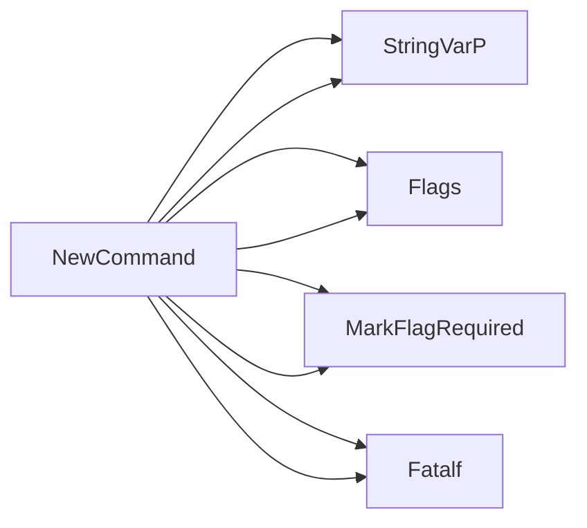

## Package feedback (github.com/redhat-best-practices-for-k8s/certsuite/cmd/certsuite/generate/feedback)

## `certsuite/cmd/certsuite/generate/feedback` – Overview

This package implements a **Cobra** command that reads a JSON file containing test‑feedback data and writes it out as a JavaScript module (`feedback.js`). The command is meant to be invoked from the `certsuite generate` sub‑command hierarchy.

---

### Global state

| Variable | Type   | Purpose |
|----------|--------|---------|
| `feedbackJSONFilePath` | `string` | Path supplied by the user for the source JSON file. |
| `feedbackOutputPath`   | `string` | Directory where the generated `feedback.js` will be written. |
| `generateFeedbackJsFile` | *func* | The actual execution function (`runGenerateFeedbackJsFile`). It is wired into Cobra via `NewCommand`. |

> **Note**: All globals are package‑private and only used by the command.

---

### Key functions

#### 1. `NewCommand() (*cobra.Command)`

Creates the `feedback` sub‑command.

*Registers flags*

| Flag | Variable | Description |
|------|----------|-------------|
| `--input` (`-i`) | `feedbackJSONFilePath` | Required; path to the JSON file containing feedback data. |
| `--output` (`-o`) | `feedbackOutputPath` | Required; directory where the JS file will be written. |

*Implementation flow*

1. Instantiate a `cobra.Command` with `Use: "feedback"`.
2. Attach the two string flags via `Flags().StringVarP`.
3. Mark both as required (`MarkFlagRequired`) – Cobra will abort if missing.
4. Assign `runGenerateFeedbackJsFile` to `RunE`, so that command execution invokes it.

> The function name comment (“Execute executes the “catalog” CLI.”) is misleading; it actually sets up the *feedback* command.

---

#### 2. `runGenerateFeedbackJsFile(cmd *cobra.Command, args []string) error`

The core logic executed when the user runs `certsuite generate feedback`.

**Workflow**

1. **Read source JSON**  
   ```go
   data, err := os.ReadFile(feedbackJSONFilePath)
   ```
   Errors are wrapped with `fmt.Errorf` and returned.

2. **Unmarshal into `interface{}`** – flexible enough to accept any JSON structure.  
3. **Marshal again with indentation** (`json.MarshalIndent`) to ensure pretty‑printed output in the JS file.

4. **Prepare destination path**  
   ```go
   dst := filepath.Join(feedbackOutputPath, "feedback.js")
   ```

5. **Create (or truncate) the file** (`os.Create`).  

6. **Write the JavaScript content**:  
   The file starts with a comment block and an export statement:
   ```js
   /* GENERATED FILE – DO NOT EDIT */
   export const feedback = <JSON>;
   ```
   The JSON is converted to string via `string(marshalled)`.

7. **Log success** – prints the destination path to stdout.

8. **Return nil on success, or wrapped errors otherwise.**

---

### How everything connects

```
[cmd] certsuite generate feedback
          │
          ▼
   NewCommand() → Cobra command (flags bound)
          │
          ▼
   user supplies --input & --output
          │
          ▼
   runGenerateFeedbackJsFile()
          ├─ read JSON file
          ├─ marshal to pretty JSON
          └─ write feedback.js with export wrapper
```

> The command is intentionally lightweight: it does **no validation** beyond flag presence and basic file I/O errors. All heavy lifting (parsing the JSON into a Go type) is deferred to `encoding/json`, which accepts any valid JSON structure.

---

### Suggested Mermaid diagram

```mermaid
flowchart TD
    A[User runs `certsuite generate feedback`] --> B[NewCommand()]
    B --> C{Flags set?}
    C -- No --> D[Error: missing required flag]
    C -- Yes --> E[runGenerateFeedbackJsFile]
    E --> F[Read JSON file]
    F --> G[Unmarshal into interface{}]
    G --> H[MarshalIndent to pretty JSON]
    H --> I[Create feedback.js]
    I --> J[Write JS export statement]
    J --> K[Print success message]
```

---

### Summary

- **Purpose**: Convert a JSON file containing test‑feedback data into an ES module (`feedback.js`) that can be imported by front‑end tooling.
- **Global state**: Three private variables – two strings for paths, one function reference.
- **Command construction**: `NewCommand` wires flags and execution routine.
- **Execution logic**: Straightforward file I/O + JSON handling in `runGenerateFeedbackJsFile`.

This module is self‑contained; it relies only on the Go standard library and Cobra. No custom data structures or interfaces are defined.

### Functions

- **NewCommand** — func()(*cobra.Command)

### Globals


### Call graph (exported symbols, partial)



### Symbol docs

- [function NewCommand](symbols/function_NewCommand.md)
