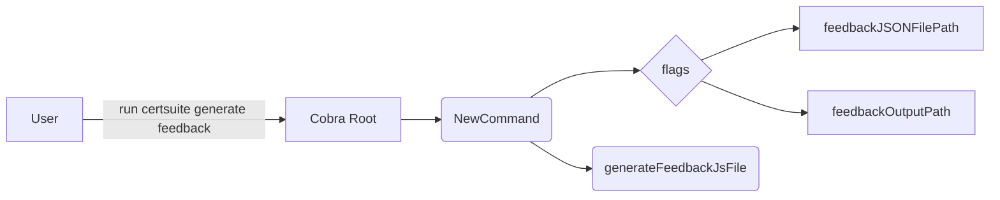

NewCommand` – CLI entry point for the *feedback* generator

### Purpose
Creates and configures a **Cobra** command that runs the feedback generation sub‑command of CertSuite.  
The returned `*cobra.Command` is meant to be added to the main `certsuite generate` command tree.

### Signature
```go
func NewCommand() (*cobra.Command, error)
```
- **Returns**: a fully configured `*cobra.Command`.  
  The function never returns an error directly; it aborts the process via `log.Fatalf` on mis‑configuration (see side effects).

> **Note**: The JSON in the prompt shows only the return type `(*cobra.Command)`, but the implementation actually exits with `log.Fatalf` when required flags are missing, so callers can treat a nil command as an unrecoverable failure.

### Inputs
None – all configuration comes from global variables and flag parsing.

### Key Operations

| Step | Action | Dependencies |
|------|--------|--------------|
| 1 | Create base `cobra.Command` (`cmd`) with `Use`, `Short`, `Long`, and `RunE`. | Cobra library |
| 2 | Define local flags on `cmd.Flags()`:<br>• `--json-file-path` (shorthand `-j`) bound to global `feedbackJSONFilePath`<br>• `--output-path` (shorthand `-o`) bound to global `feedbackOutputPath` | Cobra flag helpers |
| 3 | Mark both flags as required with `MarkFlagRequired`. | Cobra |
| 4 | In the `RunE` closure, read the values of the flags and assign them to the globals. The closure then calls `generateFeedbackJsFile()`, which performs the actual generation logic. | Global variables; `generateFeedbackJsFile()` function (defined elsewhere in this package) |
| 5 | If a required flag is missing or an error occurs during generation, log the problem with `log.Fatalf`. | Standard library `log` |

### Dependencies & Side Effects

- **Cobra** – for command and flag handling.  
- **Standard library (`log`, `os`)** – for fatal errors that terminate the process.  
- **Global variables** – `feedbackJSONFilePath`, `feedbackOutputPath` are mutated by the flag parsing step; these globals are later read by `generateFeedbackJsFile`.  
- **External function** – `generateFeedbackJsFile()` performs the heavy lifting of writing feedback data to a JavaScript file. Its signature and internals are not shown here, but it is assumed to write to `feedbackOutputPath` based on the JSON content at `feedbackJSONFilePath`.

### How It Fits the Package

The `feedback` package provides a sub‑command for CertSuite’s CLI that generates a feedback JavaScript file from a JSON specification.  
- `NewCommand()` constructs the Cobra command used by the top‑level `certsuite generate` command.  
- The global variables hold flag values so other functions in the package can access them without needing to pass around context or state explicitly.



### Summary

`NewCommand` is the public constructor for the *feedback* CLI command. It wires up required flags, ensures they are provided, stores their values in package‑level globals, and triggers the generation routine. The function relies on Cobra for flag handling and terminates with `log.Fatalf` on any misconfiguration or runtime error.
