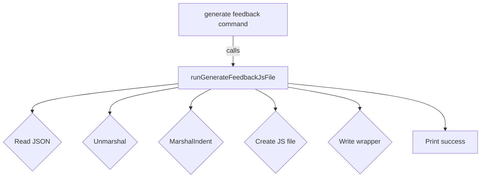

runGenerateFeedbackJsFile`

| Aspect | Detail |
|--------|--------|
| **Package** | `github.com/redhat-best-practices-for-k8s/certsuite/cmd/certsuite/generate/feedback` |
| **Signature** | `func(*cobra.Command, []string) error` |
| **Visibility** | Unexported – used only by the command implementation in this package. |

### Purpose
This helper is invoked by the *generate feedback* sub‑command of CertSuite.  
It reads a JSON file that contains user‑provided feedback, transforms that data into a JavaScript module (`feedback.js`), writes it to disk and prints a short success message.

The generated `feedback.js` exports an object named **`certsuiteFeedback`** that holds the parsed JSON data.  The file is intended for consumption by downstream tooling (e.g., UI dashboards) or by the CertSuite test harness itself.

### Inputs
| Parameter | Type | Description |
|-----------|------|-------------|
| `cmd *cobra.Command` | *unused* | Provided by Cobra; not used inside this function. |
| `args []string` | *unused* | Arguments passed on the CLI; this command expects none. |

The real inputs are the two package‑level variables that hold file paths:

| Variable | Type | Role |
|----------|------|------|
| `feedbackJSONFilePath` | `string` | Path to the JSON file containing the raw feedback. |
| `feedbackOutputPath` | `string` | Directory where the generated `feedback.js` should be written. |

### Key Steps (with dependencies)

1. **Read JSON**  
   ```go
   data, err := os.ReadFile(feedbackJSONFilePath)
   ```
   *Dependency*: `os.ReadFile`. Errors are wrapped with `fmt.Errorf`.

2. **Unmarshal into a generic map**  
   ```go
   var content interface{}
   if err := json.Unmarshal(data, &content); ...
   ```
   *Dependencies*: `encoding/json.Unmarshal`.

3. **Marshal back with indentation** (pretty‑print)  
   ```go
   prettyJSON, err := json.MarshalIndent(content, "", "  ")
   ```
   *Dependency*: `json.MarshalIndent`. The resulting bytes are UTF‑8 encoded.

4. **Create output file**  
   ```go
   f, err := os.Create(filepath.Join(feedbackOutputPath, "feedback.js"))
   ```
   *Dependencies*: `os.Create`, `path/filepath.Join`.

5. **Write JavaScript wrapper**  
   The function writes a minimal JS module that assigns the JSON to a global variable:
   ```js
   const certsuiteFeedback = <prettyJSON>;
   export default certsuiteFeedback;
   ```
   *Dependencies*: `io.Writer.WriteString`, string concatenation.

6. **Close file & report**  
   After closing, it prints a short confirmation message with `fmt.Println`.

### Side Effects

| Effect | Details |
|--------|---------|
| **File creation / overwrite** | The function unconditionally creates or truncates `feedback.js` in the target directory. |
| **Console output** | Prints “Wrote feedback js file: …” to stdout on success, which can be useful for debugging but is not captured elsewhere. |
| **Error propagation** | Any I/O or JSON error causes an immediate return with a wrapped error; callers must handle it (Cobra will print the message). |

### Interaction with the rest of the package

- The command that registers this function (`generateFeedbackJsFile`) simply calls `runGenerateFeedbackJsFile` and reports any returned error.
- The global variables are set by Cobra flags or defaults when the sub‑command is initialized, ensuring the correct paths are used at runtime.

### Suggested Mermaid Diagram (package structure)



### Summary

`runGenerateFeedbackJsFile` is a small, side‑effecting helper that bridges the JSON feedback supplied by users to a JavaScript module consumable by other parts of CertSuite.  It encapsulates file I/O and JSON handling, returning an error if any step fails, so higher‑level command logic can present meaningful diagnostics to the user.
