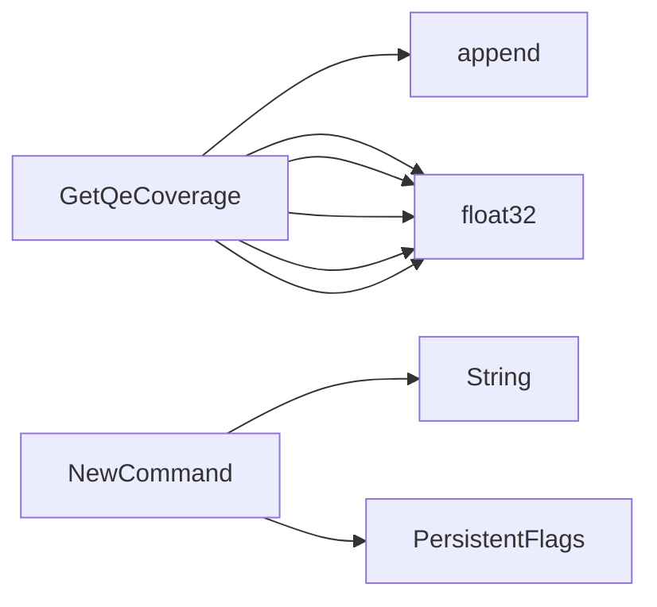

## Package qecoverage (github.com/redhat-best-practices-for-k8s/certsuite/cmd/certsuite/generate/qe_coverage)

# `qecoverage` – Quick‑E Coverage Reporter

The *qecoverage* command is part of the CertSuite CLI and produces a summary of how many
certification test cases are implemented by Red Hat’s Quick‑E (QE) platform.
It lives under  
`github.com/redhat-best-practices-for-k8s/certsuite/cmd/certsuite/generate/qe_coverage`.

---

## 1. Core Data Structures

| Type | Purpose | Key Fields |
|------|---------|------------|
| `TestCoverageSummaryReport` (exported) | Aggregated coverage for all test suites. | `CoverageByTestSuite map[string]TestSuiteQeCoverage` – per‑suite data.<br>`TestCasesTotal int` – total test cases processed.<br>`TestCasesWithQe int` – how many have QE implementations.<br>`TotalCoveragePercentage float32` – overall coverage (percentage). |
| `TestSuiteQeCoverage` (exported) | Per‑test‑suite statistics. | `Coverage float32` – percentage of tests in this suite that are QE‑covered.<br>`NotImplementedTestCases []string` – list of test case IDs missing QE support.<br>`TestCases int` – total cases in the suite.<br>`TestCasesWithQe int` – how many of those have QE. |

These structs form a lightweight JSON‑serialisable report that can be printed or
written to disk.

---

## 2. Global State

| Name | Type | Notes |
|------|------|-------|
| `qeCoverageReportCmd` (unexported) | `*cobra.Command` | Holds the Cobra command instance for `generate qe-coverage`. It is created in `NewCommand()` and later used by the root CLI. |

A small constant:

```go
const multiplier = 100
```

Used to convert a ratio into a percentage.

---

## 3. Key Functions

### 3.1 Command Construction

```go
func NewCommand() *cobra.Command
```

* Creates the `qe-coverage` sub‑command.
* Adds a persistent flag (`--test-case-name`) that allows filtering output by a single test case ID.
* Returns the fully configured command for registration in the CLI tree.

### 3.2 Coverage Computation

```go
func GetQeCoverage(testCaseMap map[claim.Identifier]claim.TestCaseDescription) TestCoverageSummaryReport
```

Takes the full mapping of test cases (obtained from `certsuite-claim`) and computes:

1. **Per‑suite stats** – counts total, QE‑covered, and not implemented.
2. **Overall totals** – aggregates across all suites.
3. **Percentages** – uses the `multiplier` constant to express coverage as a float percentage.

The result is a fully populated `TestCoverageSummaryReport`.

### 3.3 Output Helpers

*`showQeCoverageForTestCaseName(testCase string, report TestCoverageSummaryReport)`*

Prints detailed information for a single test case:
- Whether it’s implemented in QE.
- The suite it belongs to and its coverage percentage.

*`showQeCoverageSummaryReport()`*

The command’s run‑function:

1. Calls `GetQeCoverage` with the global test‑case map (`identifiers.TestCaseMap`).  
2. If the `--test-case-name` flag is set, delegates to `showQeCoverageForTestCaseName`.  
3. Otherwise prints a table of all suites: name, coverage %, total tests, QE tests, and a list of missing cases.

Both helpers use plain `fmt.Println/Printf`, keeping the CLI output human‑readable.

---

## 4. Flow Diagram (Mermaid)

```mermaid
flowchart TD
    A[CLI Root] --> B[generate qe-coverage]
    B --> C{Flag: --test-case-name?}
    C -->|No| D[GetQeCoverage(testCaseMap)]
    D --> E[Print summary table]
    C -->|Yes| F[showQeCoverageForTestCaseName(name, report)]
```

---

## 5. How It All Connects

1. **Entry Point** – `NewCommand()` creates the Cobra command and registers it.
2. **Execution** – When the user runs `certsuite generate qe-coverage`, Cobra invokes `showQeCoverageSummaryReport`.
3. **Data Gathering** – The function pulls all test case metadata from `identifiers.TestCaseMap` (a map of `claim.Identifier` to `claim.TestCaseDescription`).
4. **Processing** – `GetQeCoverage` walks the map, grouping by suite, counting totals, and calculating percentages.
5. **Presentation** – Depending on flags, either a single test case’s details or a full per‑suite table is printed.

---

## 6. Summary

- **Purpose:** Quickly show how many certification tests are supported by Red Hat QE.
- **Data Model:** Two nested structs (`TestCoverageSummaryReport` → `TestSuiteQeCoverage`) store totals and percentages.
- **CLI Interaction:** One command with an optional filter flag; output is plain text, easy to read or pipe to a file.

The package remains read‑only from the perspective of this overview – all state is local to the command execution, making it safe for concurrent use in larger tooling pipelines.

### Structs

- **TestCoverageSummaryReport** (exported) — 4 fields, 0 methods
- **TestSuiteQeCoverage** (exported) — 4 fields, 0 methods

### Functions

- **GetQeCoverage** — func(map[claim.Identifier]claim.TestCaseDescription)(TestCoverageSummaryReport)
- **NewCommand** — func()(*cobra.Command)

### Globals


### Call graph (exported symbols, partial)



### Symbol docs

- [struct TestCoverageSummaryReport](symbols/struct_TestCoverageSummaryReport.md)
- [struct TestSuiteQeCoverage](symbols/struct_TestSuiteQeCoverage.md)
- [function GetQeCoverage](symbols/function_GetQeCoverage.md)
- [function NewCommand](symbols/function_NewCommand.md)
