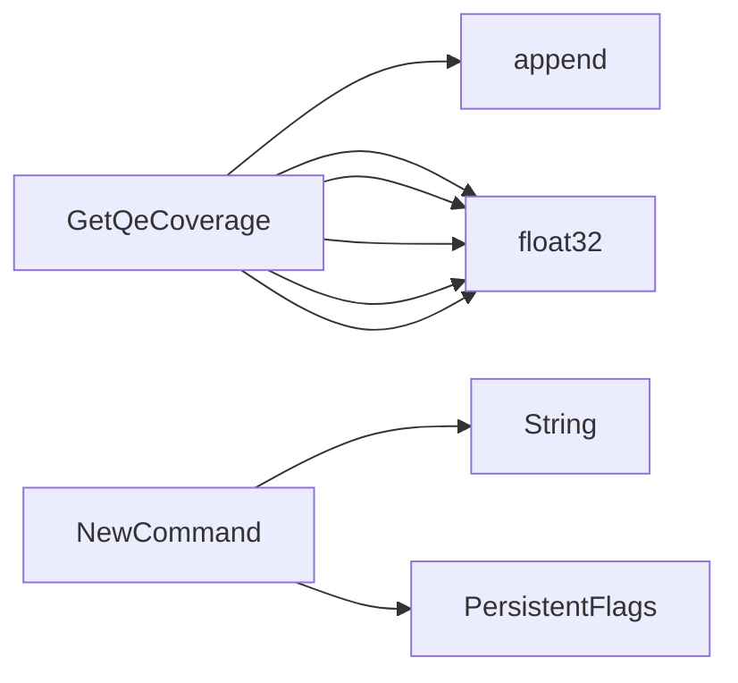

## Package qecoverage (github.com/redhat-best-practices-for-k8s/certsuite/cmd/certsuite/generate/qe_coverage)

### Structs

- **TestCoverageSummaryReport** (exported) — 4 fields, 0 methods
- **TestSuiteQeCoverage** (exported) — 4 fields, 0 methods

### Functions

- **GetQeCoverage** — func(map[claim.Identifier]claim.TestCaseDescription)(TestCoverageSummaryReport)
- **NewCommand** — func()(*cobra.Command)

### Globals

### Call graph (exported symbols, partial)

### Symbol docs

- [struct TestCoverageSummaryReport](symbols/struct_TestCoverageSummaryReport.md)
- [struct TestSuiteQeCoverage](symbols/struct_TestSuiteQeCoverage.md)
- [function GetQeCoverage](symbols/function_GetQeCoverage.md)
- [function NewCommand](symbols/function_NewCommand.md)
