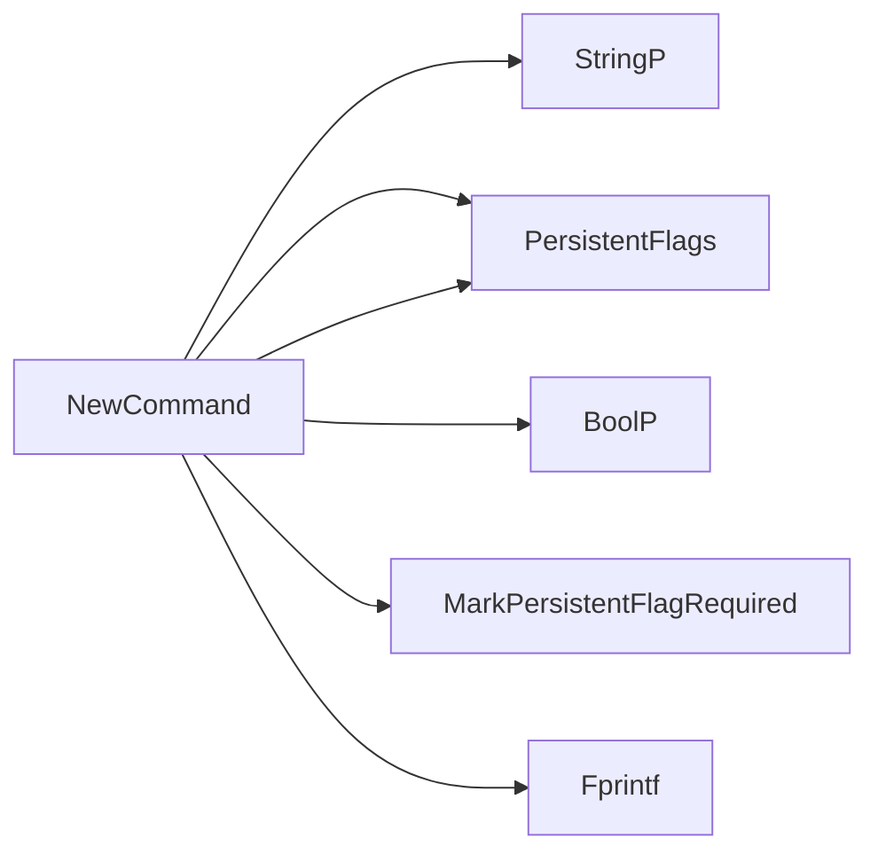

## Package info (github.com/redhat-best-practices-for-k8s/certsuite/cmd/certsuite/info)

# certsuite `info` Package Overview

| Item | Description |
|------|-------------|
| **Purpose** | Provides the `certsuite info` CLI command that lists or displays detailed information about test cases in the CertSuite checks database. |
| **Global state** | - `infoCmd` – a *cobra.Command* instance that is created by `NewCommand`.  <br>- `lineMaxWidth` – an integer that holds the terminal width (set once per run). |
| **Constants** | `linePadding = 4` – used to create a margin around each printed box. |

---

## Core Functions

### 1. `NewCommand() *cobra.Command`
Creates and configures the root command for the `info` sub‑command.

* Adds persistent flags:
  * `--test-id` (`-t`) – string, required.
  * `--verbose` (`-v`) – bool.
* Marks `test-id` as required to avoid accidental empty queries.
* Prints usage information when validation fails.

> **Usage**  
```bash
certsuite info --test-id <expr>
```

### 2. `showInfo(cmd *cobra.Command, args []string) error`
The command handler invoked by Cobra.

1. Reads flags: `--test-id` and `--verbose`.
2. Calls `getMatchingTestIDs()` to resolve the user expression against the checks DB.
3. If no matches → return an error.
4. Depending on `--verbose`:
   * **Non‑verbose** – call `printTestList(ids)` which prints a plain list of IDs.
   * **Verbose** –  
     1. Calls `adjustLineMaxWidth()` to set the terminal width for pretty printing. <br>
     2. Retrieves full test descriptions via `getTestDescriptionsFromTestIDs(ids)`. <br>
     3. For each description, calls `printTestCaseInfoBox(desc)`.

### 3. `getMatchingTestIDs(expr string) ([]string, error)`
Filters the internal checks database for IDs matching *expr* (label or glob).

* Uses `checksdb.LoadInternalChecksDB()` to load the DB.
* Calls `checksdb.FilterCheckIDs()` with an evaluator created by
  `claim.InitLabelsExprEvaluator()`.
* Returns a slice of matching test‑case IDs.

### 4. `getTestDescriptionsFromTestIDs(ids []string) []claim.TestCaseDescription`
Transforms a list of IDs into the richer description structs used for printing.
Simply appends each loaded `claim.TestCaseDescription` to a new slice.

### 5. `printTestList(ids []string)`
A minimal helper that prints the number of matches followed by each ID on its own line.

### 6. `printTestCaseInfoBox(desc *claim.TestCaseDescription)`
Pretty‑prints one test case inside a colored ASCII box.
Uses helpers from `github.com/redhat-best-practices-for-k8s/certsuite/internal/cli`:

* `LineColor`, `LineAlignCenter`, `LineAlignLeft`
* `WrapLines` to respect the terminal width (`lineMaxWidth`)
* Repeatedly draws top/bottom borders, title, description, and tags.

### 7. `adjustLineMaxWidth()`
If the current process is attached to a TTY, obtains its width with
`golang.org/x/term.GetSize`.  
Subtracts `linePadding` so that boxes never overflow the terminal.

---

## Flow Diagram (textual)

```
user runs: certsuite info --test-id "<expr>" [--verbose]
          |
          v
  NewCommand() creates cobra.Command with flags
          |
          v
showInfo(cmd, args)
          |
          |-- read flags
          |
          |-- getMatchingTestIDs(expr) --> []ids
          |      (LoadInternalChecksDB -> FilterCheckIDs)
          |
          |-- if verbose:
          |        adjustLineMaxWidth()
          |        descs = getTestDescriptionsFromTestIDs(ids)
          |        for each d in descs: printTestCaseInfoBox(d)
          |   else:
          |        printTestList(ids)
```

---

## Key Points

* **No mutable data structures** – the package only reads from the checks DB and writes to stdout.
* **Terminal awareness** – `adjustLineMaxWidth` ensures output fits the user’s terminal.
* **Separation of concerns** –  
  * `getMatchingTestIDs` handles filtering logic.  
  * `printTestCaseInfoBox` handles presentation.  
  * `showInfo` orchestrates based on flags.

This design keeps command parsing, data access, and rendering independent, making the package easy to maintain or extend (e.g., adding new output formats).

### Functions

- **NewCommand** — func()(*cobra.Command)

### Globals


### Call graph (exported symbols, partial)



### Symbol docs

- [function NewCommand](symbols/function_NewCommand.md)
