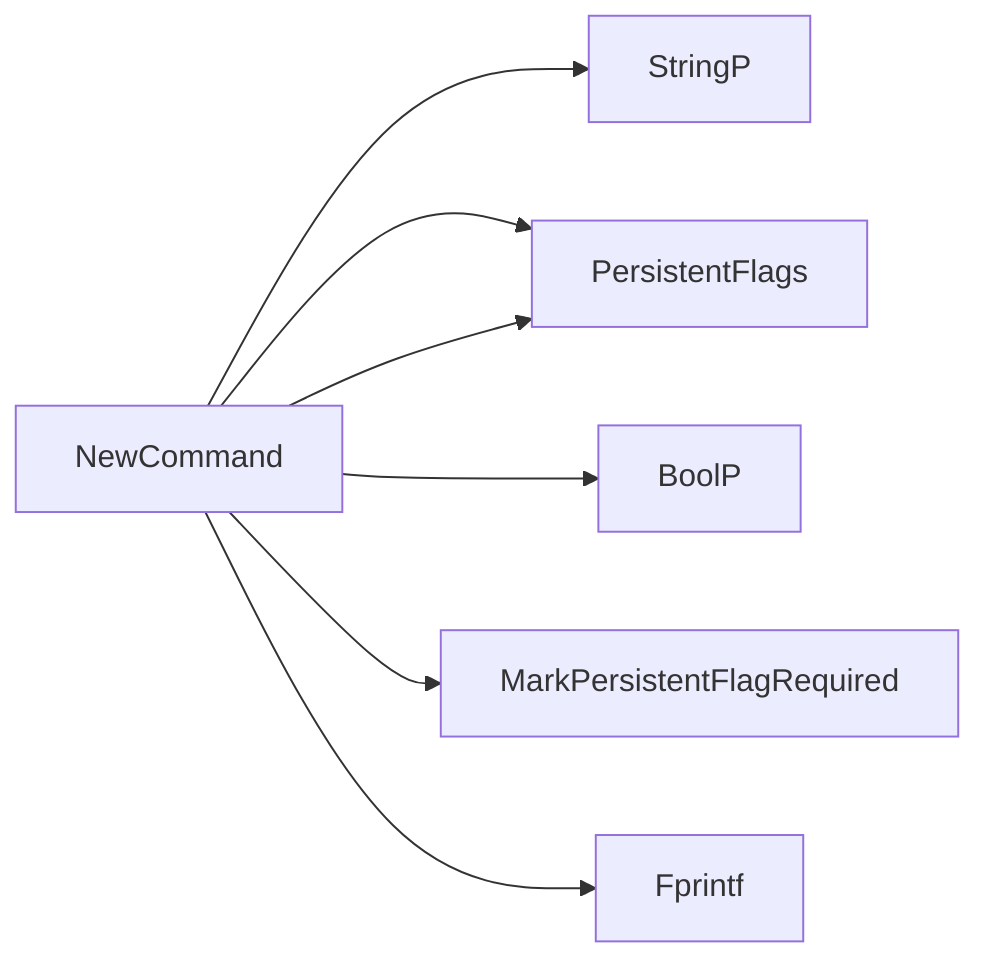

## Package info (github.com/redhat-best-practices-for-k8s/certsuite/cmd/certsuite/info)

### Functions

- **NewCommand** — func()(*cobra.Command)

### Globals

### Call graph (exported symbols, partial)

### Symbol docs

- [function NewCommand](symbols/function_NewCommand.md)
