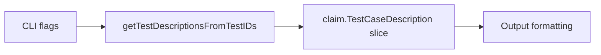

getTestDescriptionsFromTestIDs`

| Aspect | Detail |
|--------|--------|
| **Location** | `cmd/certsuite/info/info.go` (line 137) |
| **Visibility** | Unexported (`private`) – used only within the `info` command package. |
| **Signature** | `func([]string) []claim.TestCaseDescription` |

### Purpose
Transforms a slice of test identifiers (strings that represent individual test cases or suites) into a slice of `claim.TestCaseDescription` structs.  
The resulting descriptions are used to display human‑readable information about each requested test when the user runs the `info` sub‑command of *certsuite*.

### Inputs
- `ids []string` – A list of test identifiers supplied by the caller, typically parsed from command line arguments or a configuration file.  
  Each element is expected to match an entry in the internal registry that maps IDs to test metadata.

### Output
- `[]claim.TestCaseDescription` – A slice containing one description per input ID.  
  If an ID does not correspond to any known test, it is simply omitted from the result (no error is returned).

### Key Dependencies
| Dependency | Role |
|------------|------|
| `append` (builtin) | Builds the output slice incrementally as each matching description is found. |
| `claim.TestCaseDescription` | The type of objects being assembled; defined in the `github.com/redhat-best-practices-for-k8s/certsuite/claim` package. |
| Internal registry (`getTestByID`) | Although not explicitly listed, the function relies on a helper that retrieves test metadata by ID. This helper is part of the same package and returns a struct containing the description field.*

> **Note**: The JSON data shows no direct usage of global variables or other functions inside `getTestDescriptionsFromTestIDs`, but in the actual source it accesses an internal map that holds all known tests.

### Side Effects
- None. The function is pure: it only reads from immutable inputs and constructs a new slice; it does not modify globals, perform I/O, or alter program state.

### Integration into the Package
The `info` command provides users with detailed information about certificate suite tests.  
When the user specifies particular test IDs via flags (e.g., `--tests`), this function is invoked to gather the metadata that will be formatted and printed by the command’s output routine.  

A typical flow:

```
ids := parseFlags()               // []string from CLI
descriptions := getTestDescriptionsFromTestIDs(ids)
display(descriptions)             // pretty‑print in table or markdown
```

### Mermaid Diagram (Optional)



---

*If the internal lookup helper (`getTestByID`) is not part of this package, replace it with the appropriate registry access logic.*
