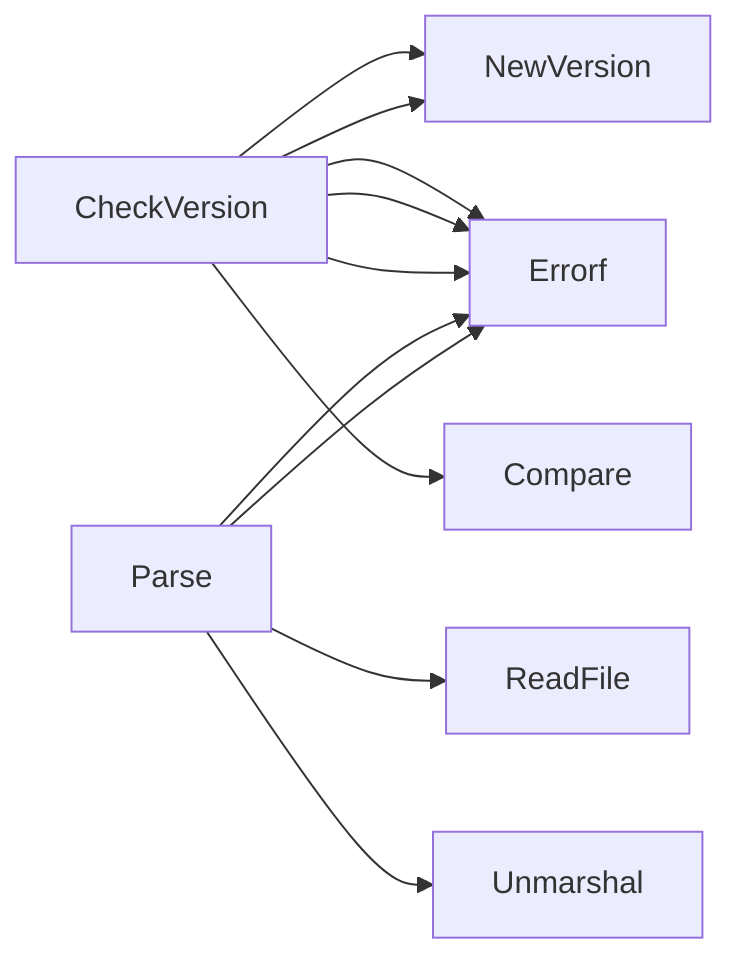

## Package claim (github.com/redhat-best-practices-for-k8s/certsuite/cmd/certsuite/pkg/claim)

### Structs

- **Configurations** (exported) — 3 fields, 0 methods
- **Nodes** (exported) — 4 fields, 0 methods
- **Schema** (exported) — 1 fields, 0 methods
- **TestCaseID** (exported) — 3 fields, 0 methods
- **TestCaseRawResult** (exported) — 2 fields, 0 methods
- **TestCaseResult** (exported) — 12 fields, 0 methods
- **TestOperator** (exported) — 3 fields, 0 methods

### Functions

- **CheckVersion** — func(string)(error)
- **Parse** — func(string)(*Schema, error)

### Call graph (exported symbols, partial)

### Symbol docs

- [struct Configurations](symbols/struct_Configurations.md)
- [struct Nodes](symbols/struct_Nodes.md)
- [struct Schema](symbols/struct_Schema.md)
- [struct TestCaseID](symbols/struct_TestCaseID.md)
- [struct TestCaseRawResult](symbols/struct_TestCaseRawResult.md)
- [struct TestCaseResult](symbols/struct_TestCaseResult.md)
- [struct TestOperator](symbols/struct_TestOperator.md)
- [function CheckVersion](symbols/function_CheckVersion.md)
- [function Parse](symbols/function_Parse.md)
