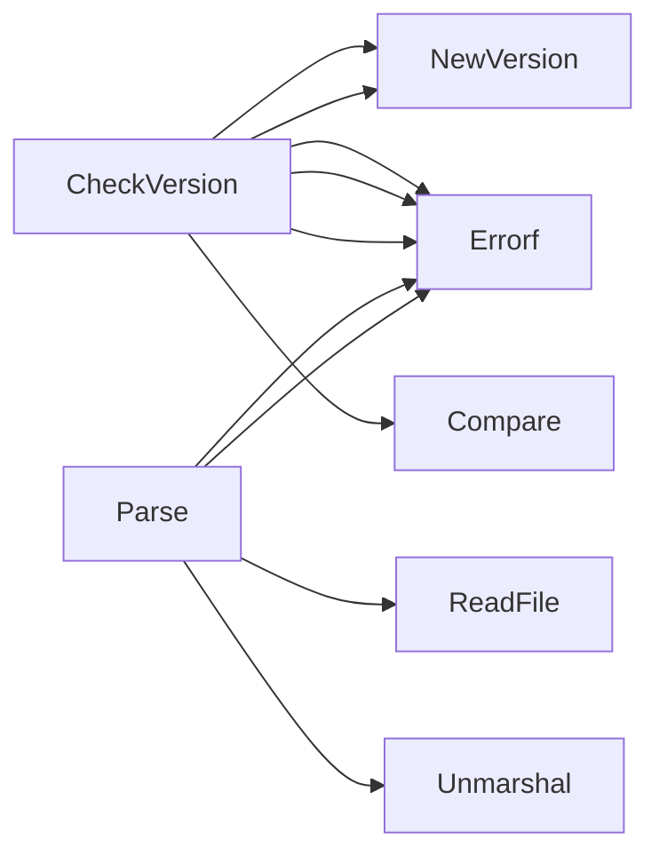

## Package claim (github.com/redhat-best-practices-for-k8s/certsuite/cmd/certsuite/pkg/claim)

## Package Overview – `github.com/redhat-best-practices-for-k8s/certsuite/cmd/certsuite/pkg/claim`

The *claim* package is a thin wrapper around the **certsuite‑claim** data model that provides:

| Responsibility | How it’s implemented |
|----------------|----------------------|
| **JSON parsing** of claim files | `Parse()` reads a file and unmarshals into the local `Schema` struct. |
| **Version checking** | `CheckVersion()` verifies that the claim file’s format version matches the one supported by this tool. |
| **Data model mapping** | Local structs (`Configurations`, `Nodes`, etc.) map directly to the fields of the official claim schema, enabling type‑safe access in the rest of the CLI. |

> *Note:* The package does not modify claims; it only validates and reads them.

---

### Key Constants

```go
const (
    TestCaseResultPassed   = "passed"
    TestCaseResultSkipped  = "skipped"
    TestCaseResultFailed   = "failed"

    supportedClaimFormatVersion = "0.1.0" // internal, not exported
)
```

*Used for:*  
- Comparing the format version in a claim file (`CheckVersion`).  
- Normalising test‑case status values when interpreting results.

---

### Core Data Structures

| Struct | Purpose | Key Fields |
|--------|---------|------------|
| **`TestCaseID`** | Lightweight identifier of a test case. | `ID`, `Suite`, `Tags` |
| **`TestCaseRawResult`** | Raw output from the runner (name + status). | `Name`, `Status` |
| **`TestCaseResult`** | Rich, fully‑described result used by the UI. | `State`, `StartTime`, `EndTime`, `Duration`, `CapturedTestOutput`, `FailureLocation`, `SkipReason`, `CatalogInfo`, `CategoryClassification`, `CheckDetails`, `TestID` |
| **`TestOperator`** | Describes an operator involved in a claim. | `Name`, `Namespace`, `Version` |
| **`Configurations`** | Holds any extra configuration data (abnormal events, raw config). | `AbnormalEvents []interface{}`, `Config interface{}`, `TestOperators []TestOperator` |
| **`Nodes`** | Aggregated node information from the claim. | `CniNetworks`, `CsiDriver`, `NodesHwInfo`, `NodesSummary` (all opaque) |
| **`Schema`** | Top‑level representation of a claim file. | `Claim struct{ Configurations; Nodes Nodes; Results TestSuiteResults; Versions officialClaimScheme.Versions }` |

> *All fields that are declared as `interface{}` or `[]interface{}` are intentionally kept generic because the exact shape is defined by external tools (e.g., certsuite‑claim).*

---

### Main Functions

#### `Parse(path string) (*Schema, error)`
1. **Read file** (`os.ReadFile`).  
2. **Unmarshal JSON** into a `Schema` instance.  
3. **Return** the parsed structure or an error.

*Typical usage:*  
```go
schema, err := claim.Parse("/path/to/claim.json")
```

#### `CheckVersion(format string) error`
1. Create semver objects for:
   - The supported format (`supportedClaimFormatVersion`).
   - The format supplied in the claim file.
2. Compare using `semver.Compare`.
3. Return an informative error if they differ.

*Typical usage:*  
```go
if err := claim.CheckVersion(schema.Claim.Versions.Format); err != nil {
    log.Fatal(err)
}
```

---

### How Everything Connects

1. **CLI entry point** loads a claim file path.
2. `Parse()` creates a `Schema` object containing:
   - Raw node data (`Nodes`).
   - Test results (`TestSuiteResults` – defined in the imported claim package).
   - The format version (`Versions.Format`).
3. `CheckVersion()` ensures the claim file is compatible before further processing.
4. Subsequent logic (not shown here) consumes the strongly‑typed fields of `Schema` to generate reports, dashboards, or upload data to external systems.

---

### Suggested Mermaid Diagram

```mermaid
flowchart TD
    A[CLI] --> B{Read File}
    B --> C[Parse() -> Schema]
    C --> D{Check Version?}
    D -- yes --> E[Proceed with analysis]
    D -- no  --> F[Exit with error]
```

This diagram captures the high‑level flow: file reading → parsing → version validation → downstream processing.

### Structs

- **Configurations** (exported) — 3 fields, 0 methods
- **Nodes** (exported) — 4 fields, 0 methods
- **Schema** (exported) — 1 fields, 0 methods
- **TestCaseID** (exported) — 3 fields, 0 methods
- **TestCaseRawResult** (exported) — 2 fields, 0 methods
- **TestCaseResult** (exported) — 12 fields, 0 methods
- **TestOperator** (exported) — 3 fields, 0 methods

### Functions

- **CheckVersion** — func(string)(error)
- **Parse** — func(string)(*Schema, error)

### Call graph (exported symbols, partial)



### Symbol docs

- [struct Configurations](symbols/struct_Configurations.md)
- [struct Nodes](symbols/struct_Nodes.md)
- [struct Schema](symbols/struct_Schema.md)
- [struct TestCaseID](symbols/struct_TestCaseID.md)
- [struct TestCaseRawResult](symbols/struct_TestCaseRawResult.md)
- [struct TestCaseResult](symbols/struct_TestCaseResult.md)
- [struct TestOperator](symbols/struct_TestOperator.md)
- [function CheckVersion](symbols/function_CheckVersion.md)
- [function Parse](symbols/function_Parse.md)
