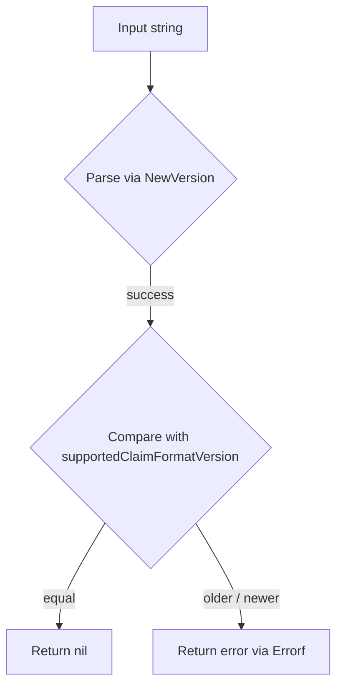

CheckVersion`

| Item | Details |
|------|---------|
| **Package** | `github.com/redhat-best-practices-for-k8s/certsuite/cmd/certsuite/pkg/claim` |
| **Exported?** | ✅ |
| **Signature** | `func CheckVersion(v string) error` |

### Purpose
`CheckVersion` validates that a claim’s version string is compatible with the tool.  
The function:

1. Parses the supplied string into an internal `Version` representation (`NewVersion`).  
2. Compares this parsed value against the package‑wide constant `supportedClaimFormatVersion`.  
3. Returns an error if the claim’s format is older or newer than what the current binary understands; otherwise it returns `nil`.

This guard prevents processing of claims that would produce undefined behaviour due to format changes.

### Parameters
| Name | Type | Description |
|------|------|-------------|
| `v` | `string` | The version string extracted from a claim (e.g. `"1.2"`). |

### Return value
- `error`:  
  - `nil` if the supplied version is exactly equal to `supportedClaimFormatVersion`.  
  - An informative error produced by `fmt.Errorf` otherwise, indicating whether the claim is too old or too new.

### Key Dependencies & Side‑Effects
| Dependency | Role |
|------------|------|
| `NewVersion(string) (Version, error)` | Parses a version string into a comparable `Version`. Called twice: once for the input and once for the supported constant. |
| `Errorf` (`fmt.Errorf`) | Builds human‑readable error messages. |
| `Compare(Version, Version) int` | Returns -1/0/+1 indicating older/equal/newer relation between two `Version`s. |
| `supportedClaimFormatVersion` (unexported constant) | The version that the current binary can handle. |

The function has **no side‑effects** beyond returning an error; it does not modify global state or mutate its input.

### How It Fits the Package
- The `claim` package deals with certificate claims and their format versions.  
- `CheckVersion` is a defensive helper used by claim‑processing code to ensure compatibility before attempting to parse or apply a claim.  
- It is typically called early in workflows that ingest external claim data.

### Usage Example

```go
if err := claim.CheckVersion(claimData.Version); err != nil {
    log.Fatalf("claim version mismatch: %v", err)
}
// safe to continue processing the claim
```

### Mermaid Diagram (optional)



This function is the single point of version validation for all claim‑handling logic in the package.
