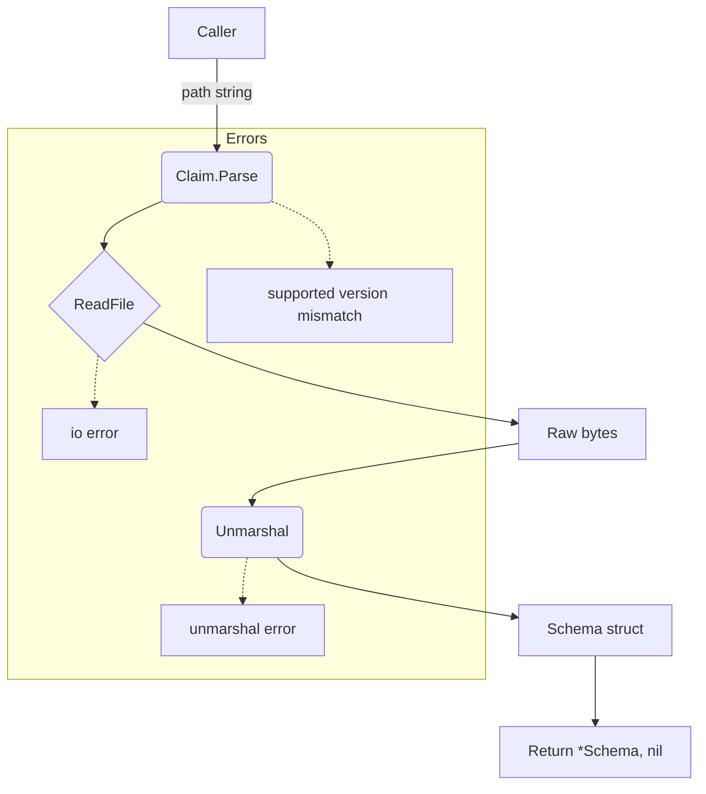

Parse` – Load and Validate a Claim Schema

## Purpose
`Parse` is the public entry point for reading a claim definition from disk into the in‑memory representation used by CertSuite.  
A *claim* describes a requirement that a certificate must satisfy (e.g., an OID, a key usage, etc.). The function:
1. Reads the file at the supplied path.
2. Unmarshals its JSON/YAML content into a `Schema` struct.
3. Performs minimal sanity checks (e.g., version support).

If any step fails, it returns a descriptive error.

---

## Signature
```go
func Parse(path string) (*Schema, error)
```

| Parameter | Type   | Description |
|-----------|--------|-------------|
| `path`    | `string` | Filesystem path to the claim definition file. |

| Return | Type        | Meaning |
|--------|-------------|---------|
| `*Schema` | pointer to a populated `Schema` instance if parsing succeeds; otherwise `nil`. |
| `error`   | error describing why parsing failed (file I/O, unmarshalling, unsupported format). |

---

## Key Dependencies
| Dependency | Role in `Parse` |
|------------|-----------------|
| `ReadFile(path)` | Reads the raw file contents into a byte slice. |
| `Unmarshal(data []byte, v interface{})` | Decodes JSON/YAML into a Go struct (`Schema`). |
| `Errorf(format string, args ...interface{})` | Generates formatted error messages on failure. |

These functions are from the standard library (`io/ioutil`, `encoding/json`) or common helper packages (e.g., `sigs.k8s.io/yaml`).

---

## Side Effects & Constraints
* **File I/O** – The function opens and reads the file; it does not modify the file.
* **No global state changes** – All data is returned via the `Schema` pointer.
* **Supported format version** – The claim file must contain a `"formatVersion"` field that matches the package’s `supportedClaimFormatVersion`. If not, parsing fails with an error.

---

## How It Fits in the Package

```
claim/
├─ schema.go          // defines Schema struct
├─ claim.go           // Parse() lives here (the function you’re documenting)
└─ ... other helpers ...
```

`Parse` is typically called by higher‑level code that loads all claims before running a test suite.  
It abstracts away file handling and format validation, allowing the rest of CertSuite to work with a clean `Schema` object.

---

## Example Usage

```go
schema, err := claim.Parse("/etc/certsuite/claims/myclaim.json")
if err != nil {
    log.Fatalf("Failed to load claim: %v", err)
}
// use schema in tests...
```

---

### Mermaid Diagram (Optional)



This diagram illustrates the linear flow of data and where errors may be produced.
