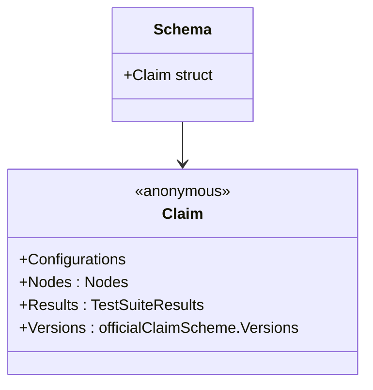

Schema` – the top‑level representation of a *claim* file

| Item | Description |
|------|-------------|
| **Purpose** | Encapsulates all data that can be expressed in a claim YAML/JSON file used by CertSuite.  The struct is the input to the command‑line tool (`certsuite claim parse`) and the output of `Parse`.  It holds the entire test suite configuration, results and metadata needed for validation and reporting. |
| **Package** | `github.com/redhat-best-practices-for-k8s/certsuite/cmd/certsuite/pkg/claim` – the package that implements reading, parsing, validating and serialising claim documents. |
| **Position in source** | Defined at line 79 of *claim.go*; its fields are nested structs pulled from other files in the same package. |

### Field layout

```go
type Schema struct {
    Claim struct{
        Configurations          // embedded – test‑suite configuration parameters
        Nodes   Nodes           // collection of node definitions (role, version, etc.)
        Results TestSuiteResults // aggregated results per node/step
        Versions officialClaimScheme.Versions // metadata about claim schema version
    }
}
```

| Field | Type | Meaning |
|-------|------|---------|
| `Configurations` | *embedded struct* | Holds configuration knobs that influence how the test suite is run (e.g. timeout, retry policy).  These fields are defined in `config.go`. |
| `Nodes` | `Nodes` | A slice of node descriptors; each node knows its role, operating system, and other attributes required for test execution.  Defined in `nodes.go`. |
| `Results` | `TestSuiteResults` | Captures the outcome of every test step per node (passed/failed, logs).  See `results.go`. |
| `Versions` | `officialClaimScheme.Versions` | Metadata that records which version of the claim schema is being used; ensures backward compatibility.  Defined in `versions.go`. |

> **Note**: The anonymous struct inside `Schema` keeps all claim data under a single top‑level key (`claim`) when marshalled to YAML/JSON, matching the official file format.

### Interaction with other parts of the package

| Direction | Function / Component | How it uses `Schema` |
|-----------|----------------------|---------------------|
| **Parsing** | `Parse(string) (*Schema, error)` (line 109) | Reads a claim file from disk, unmarshals into a `Schema`, and returns it.  Errors propagate if the file cannot be read or decoded. |
| **Validation** | `Validate()` (not shown here but part of the package) | Consumes a `*Schema` to check that required fields are present and that node results match expectations. |
| **Reporting** | `GenerateReport(*Schema)` | Builds human‑readable summaries from the `Results` field. |

### Side effects & invariants

* **Immutable after parsing** – `Parse` returns a pointer but never mutates the returned object elsewhere in the package; callers are free to modify it for custom reporting or mutation tests.
* **Strict format adherence** – The YAML/JSON layout is dictated by the nested anonymous struct; any deviation will cause `Unmarshal` to fail, leading to an error from `Parse`.
* **Dependencies** – Requires the helper types (`Nodes`, `TestSuiteResults`, `officialClaimScheme.Versions`) to be correctly defined; these are in separate files but share the same package.

### Mermaid diagram (optional)



This diagram shows that `Schema` is essentially a wrapper around the single top‑level `claim` key, which itself bundles configuration, nodes, results and version metadata.
