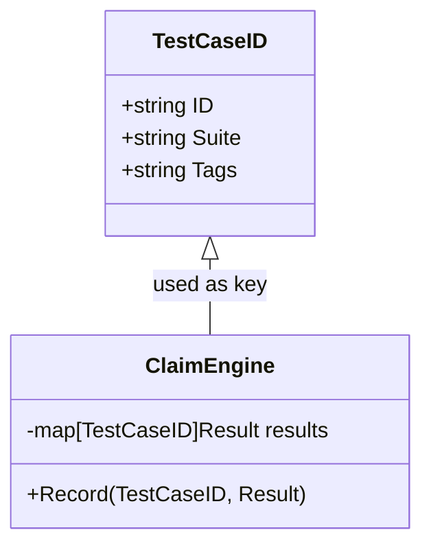

TestCaseID` – A Lightweight Identifier for Test Cases

| Item | Description |
|------|-------------|
| **Package** | `claim` (`github.com/redhat-best-practices-for-k8s/certsuite/cmd/certsuite/pkg/claim`) |
| **Location** | `/Users/deliedit/dev/certsuite/cmd/certsuite/pkg/claim/claim.go:27` |
| **Visibility** | Exported – usable by other packages |

## Purpose

`TestCaseID` encapsulates the minimal information needed to reference a test case inside CertSuite.  
It is used wherever a unique identifier for a test case must be passed around, e.g.:

* Recording results in the test engine.
* Filtering or selecting tests by suite or tag during execution.
* Serialising test metadata into JSON/YAML files.

By keeping the struct small and flat it guarantees fast copy‑by‑value semantics and trivial marshaling.

## Fields

| Field | Type   | Typical Value | Notes |
|-------|--------|---------------|-------|
| `ID`  | `string` | `"testcase-123"` | Primary key – usually a UUID or sequential number. |
| `Suite` | `string` | `"cis-k8s-1.25"` | Logical grouping of tests; used for suite‑level filtering. |
| `Tags` | `string` | `"critical,networking"` | Comma‑separated tags that describe test characteristics. |

> **Why strings?**  
> The CertSuite configuration is JSON/YAML based, so keeping everything as strings simplifies marshaling and CLI flag handling.

## Inputs / Outputs

* **Construction:** Typically created by the test runner or a YAML parser. Example:
  ```go
  tc := TestCaseID{ID: "tc-001", Suite: "cis-k8s", Tags: "networking,critical"}
  ```
* **Usage as Key:** Often used as map keys (`map[TestCaseID]Result`) because it is comparable.
* **Serialization:** Implements `encoding/json` automatically; the struct will be marshaled to:
  ```json
  {"ID":"tc-001","Suite":"cis-k8s","Tags":"networking,critical"}
  ```

## Dependencies

* No external imports – purely a data holder.
* Relies on the surrounding package for higher‑level logic (e.g., `claim.TestCase` struct, test execution engine).

## Side Effects

None.  
It is a plain value type; no state mutation or I/O occurs.

## How It Fits the Package

The `claim` package orchestrates test case metadata and result reporting.  
`TestCaseID` serves as the **public key** for:

1. **Mapping results** – Results are stored in maps keyed by this struct.
2. **Filtering** – The CLI can filter tests by suite or tag, translating those options into a slice of `TestCaseID`s.
3. **Reporting** – When generating JSON reports, each entry references the corresponding `TestCaseID`.

Because it is lightweight and comparable, it enables efficient lookups and clean serialization without extra boilerplate.

---

### Mermaid diagram (suggestion)



This diagram illustrates how `TestCaseID` is employed within the claim engine to store and retrieve test results.
