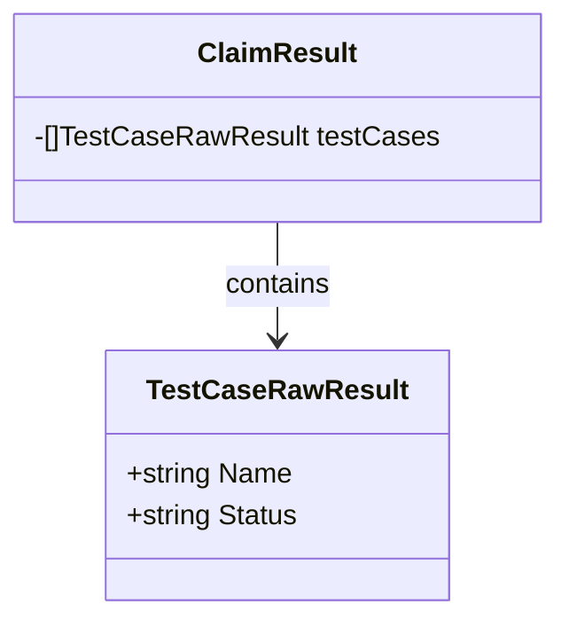

TestCaseRawResult`

| Attribute | Description |
|-----------|-------------|
| **Name**  | Identifier of the test case (e.g., `"pod-1-access"`) |
| **Status**| Raw status string returned by a test runner (commonly `"pass"`, `"fail"`, or `"unknown"`). |

### Purpose
`TestCaseRawResult` is a lightweight container used throughout the `claim` package to capture the raw outcome of an individual test case. The package orchestrates end‑to‑end compliance checks against Kubernetes workloads; each check produces a status string that needs to be persisted, logged, or transformed into higher‑level metrics. This struct provides a minimal, serializable representation that can be marshalled to JSON/YAML when generating claim reports.

### Inputs / Outputs
- **Input** – The fields are populated by callers (e.g., test runners or report parsers) that have already executed a check and determined its result.
- **Output** – Instances of this struct are typically returned from helper functions, written to files, or included in larger claim objects for downstream consumption.

### Key Dependencies
| Dependency | Role |
|------------|------|
| `encoding/json` / `gopkg.in/yaml.v2` | If the package serializes claims, these packages will marshal/unmarshal `TestCaseRawResult`. |
| `github.com/redhat-best-practices-for-k8s/certsuite/cmd/certsuite/pkg/claim` (self) | The struct resides here and is referenced by other claim‑related types such as `ClaimReport`. |

### Side Effects
The struct itself has **no side effects**. It is a plain data holder; any logic that interprets or transforms its values lives elsewhere in the package.

### How it Fits the Package
Within `claim`, test results are aggregated into *claims* (overall compliance assertions). `TestCaseRawResult` represents the most granular piece of information—a single test case's raw status. Higher‑level types like `ClaimResult` or `Report` embed slices of this struct to form a complete view of all checks performed during a run.

#### Suggested Mermaid Diagram

This diagram illustrates the relationship between a claim’s aggregated result and its constituent raw test case results.
