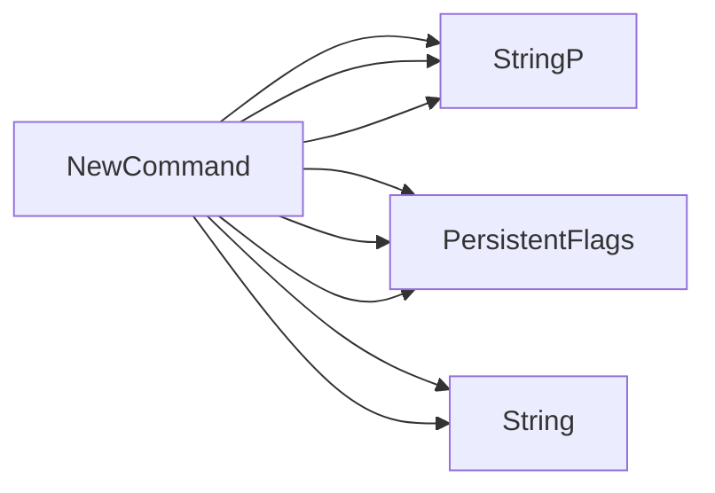

## Package run (github.com/redhat-best-practices-for-k8s/certsuite/cmd/certsuite/run)

# `run` package – CLI entry point for CertSuite

The **run** package implements the `certsuite run` command that launches a test suite in either “direct” or “server‑driven” mode.

| Element | Role |
|---------|------|
| `runCmd *cobra.Command` | Holds the Cobra command object that is registered by the top‑level CLI. It’s created once in `init()` and exposed via `NewCommand()`. |
| `timeoutFlagDefaultvalue` | Default timeout string (`"30s"`). Used when parsing the `--timeout` flag. |

## Core Functions

### `NewCommand() *cobra.Command`
* Builds a new Cobra command named **run**.
* Adds many persistent flags (e.g., `--config`, `--namespace`, `--cert-dir`, etc.) that configure test parameters.
* Returns the configured command so it can be attached to the root CLI.

> **Key point** – this function only sets up flag parsing; all values are later read from the command in `runTestSuite`.

### `initTestParamsFromFlags(cmd *cobra.Command) error`
Takes a Cobra command, reads every persistent flag value and writes them into the global test‑parameter structure (`configuration.GetTestParameters()`).

Typical flow:
1. Call `cmd.Flags().GetXxx("flag-name")` for each supported flag.
2. Populate fields such as `Namespace`, `CertDir`, `Timeout`, `ServerMode`, etc., on the returned test‑parameters object.

If any flag is missing or malformed, an error is returned to abort execution early.

### `runTestSuite(cmd *cobra.Command, args []string) error`
The actual command handler invoked when the user runs `certsuite run`.

1. **Initialize flags** – calls `initTestParamsFromFlags`.  
2. **Startup** – starts a web server (`webserver.StartServer`) if `ServerMode` is true.  
3. **Run tests** – `certsuite.Run()` executes the test suite, using parameters set earlier.  
4. **Shutdown** – stops the web server and performs any cleanup.  

The function logs progress with `log.Info`, aborts on fatal errors via `log.Fatal`, and returns a final error status.

## Flow Diagram (suggested Mermaid)

```mermaid
flowchart TD
  A[certsuite run] --> B[NewCommand]
  B --> C[runTestSuite]
  C --> D[initTestParamsFromFlags]
  D --> E[TestParameters populated]
  C --> F[webserver.StartServer?]
  F -- yes --> G[Start server]
  C --> H[certsuite.Run()]
  H --> I[Run tests]
  I --> J[Shutdown]
  J --> K[Exit]
```

## Summary

* **Globals**: `runCmd` (Cobra command) and a timeout default.  
* **Flags**: All test‑related options are defined in `NewCommand()`; they’re parsed into the shared configuration by `initTestParamsFromFlags`.  
* **Execution**: `runTestSuite` orchestrates startup, execution, and teardown, handling both local and server modes.

This structure keeps flag parsing separate from business logic, enabling unit tests for each component.

### Functions

- **NewCommand** — func()(*cobra.Command)

### Globals


### Call graph (exported symbols, partial)



### Symbol docs

- [function NewCommand](symbols/function_NewCommand.md)
