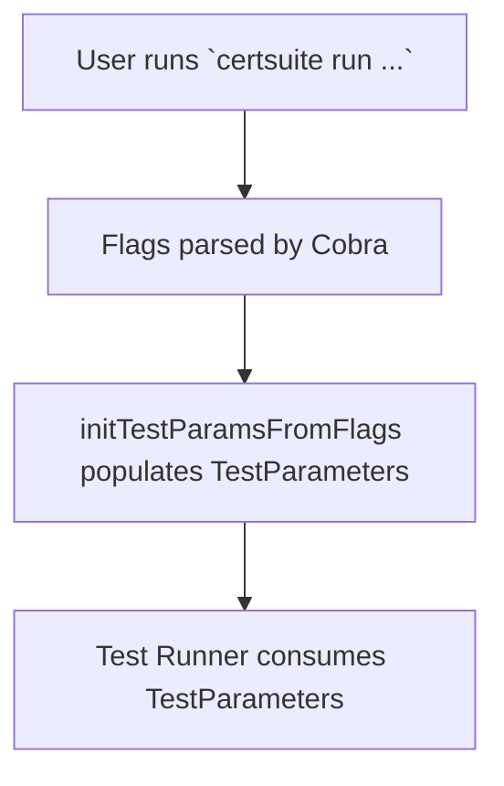

initTestParamsFromFlags`

*Location:* `cmd/certsuite/run/run.go:57`  
*Package:* `run` – a command‑line subcommand for the CertSuite CLI.

### Purpose
Populates the global *test parameters* structure (`GetTestParameters()`) with values supplied via Cobra flags on the `run` command.  
The function is used as a *pre‑execution hook* (e.g., `PreRunE`) to validate and store user‑provided options before any test execution begins.

### Signature
```go
func initTestParamsFromFlags(cmd *cobra.Command) error
```
- **Parameters**
  - `cmd`: the Cobra command instance that invoked this function.  
    It is used only for flag lookup; the function does not modify the command itself.
- **Returns**: an `error`.  
  The function returns `nil` on success or propagates any errors returned by flag accessors (rare, as flag parsing normally succeeds).

### Key Dependencies
| Dependency | Role |
|------------|------|
| `cmd.Flags()` | Provides access to the command’s flag set. |
| `GetString`, `GetBool` | Cobra helpers that read string and boolean flag values, respectively. |
| `GetTestParameters()` | Returns a pointer to the package‑wide test parameter struct where all flag values are stored. |

The function iterates over a fixed list of flags (e.g., `--certs-dir`, `--skip-scan`, `--output-format`, …) and writes each value into the corresponding field in the test parameters struct.

### Side Effects
- **State mutation**: Writes to the global test parameter structure.  
  Subsequent functions that rely on these values (e.g., the actual test runner) will read from this mutated state.
- **No I/O or external side effects**: All operations are purely in‑memory; no files, network, or database interactions occur.

### How It Fits Into the Package
1. **Command Setup (`runCmd`)** – The `run` command is defined with many persistent flags (see `run.go:19`).  
2. **Pre‑Execution Hook** – `initTestParamsFromFlags` is registered as a pre‑run hook so that, before any test logic executes, all flag values are collected into the shared parameter struct.
3. **Execution** – The actual test runner reads from this struct to determine what tests to run and how.

### Suggested Mermaid Diagram


### Unknowns
- The exact names and semantics of all flags are not visible in the snippet, but they follow the pattern `GetString`/`GetBool` applied to flag names such as `"certs-dir"`, `"skip-scan"`, etc.  
- The internal structure of the test parameters (field names/types) is inferred only by usage; details would require inspecting `GetTestParameters()` implementation.
