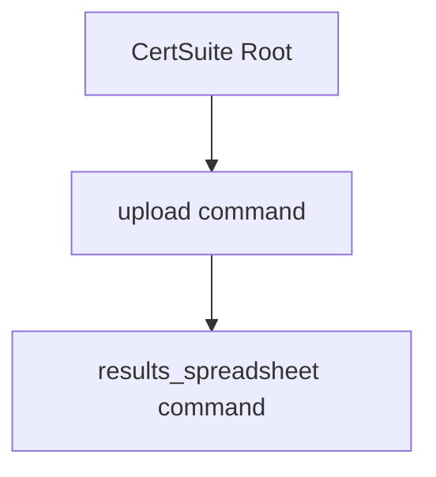

## Package upload (github.com/redhat-best-practices-for-k8s/certsuite/cmd/certsuite/upload)

# Package `upload`

The *upload* package is a thin wrapper that exposes the **`upload`** command for the CertSuite CLI.  
It does not define any data structures or interfaces – its sole responsibility is to create a
`cobra.Command`, attach sub‑commands, and expose it to the root command.

---

## Global state

| Name | Type | Purpose |
|------|------|---------|
| `upload` | `*cobra.Command` (declared but never initialized in this file) | Holds the top‑level *upload* command. The variable is defined for future extensions or tests; currently it is not used inside the package.

---

## Key function

### `NewCommand() (*cobra.Command, error?)`

**Signature**

```go
func NewCommand() *cobra.Command
```

| Step | What happens |
|------|--------------|
| 1. Create a new `*cobra.Command` named `"upload"` with a short description. |
| 2. Register sub‑commands: <br>• `results_spreadsheet.NewCommand()` – the command that uploads a results spreadsheet to an S3 bucket. |
| 3. Return the fully constructed command. |

The function is called by the root command in `cmd/certsuite/main.go` (or equivalent) so that
the *upload* feature becomes available when the CLI runs.

---

## How it fits into CertSuite

```
certsuite (root)
├─ upload          <-- this package's NewCommand()
│   └─ results_spreadsheet  <-- sub‑command defined in its own package
└─ other commands
```

When a user runs:

```bash
certsuite upload results-spreadsheet ...
```

the root command delegates to the `upload` command, which in turn forwards execution to
`results_spreadsheet.NewCommand()`.  
This keeps the CLI modular and allows each sub‑command package to manage its own flags,
validation, and execution logic.

---

## Suggested Mermaid diagram



This visual shows the hierarchy: the root command owns `upload`, which owns the spreadsheet sub‑command.

---

### Summary

- **No structs or interfaces** – only a single helper function and an unused global variable.
- **`NewCommand`** builds the `cobra.Command` tree for uploading results spreadsheets.
- The package acts as a plug‑in point in the overall CertSuite CLI architecture.

### Functions

- **NewCommand** — func()(*cobra.Command)

### Globals


### Call graph (exported symbols, partial)


### Symbol docs

- [function NewCommand](symbols/function_NewCommand.md)
