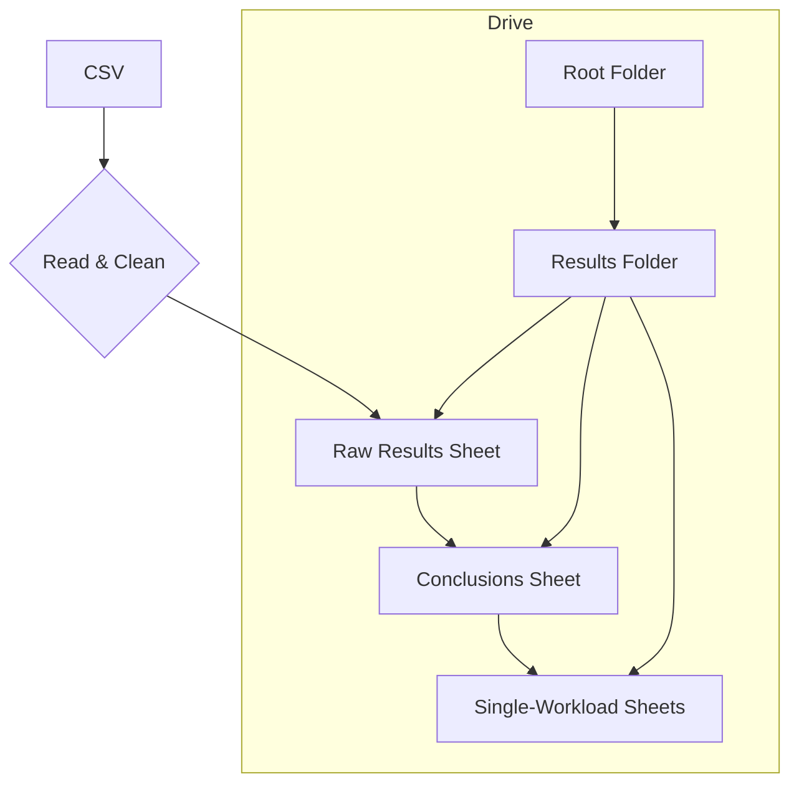
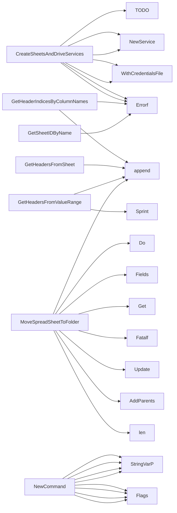

## Package resultsspreadsheet (github.com/redhat-best-practices-for-k8s/certsuite/cmd/certsuite/upload/results_spreadsheet)

## `resultsspreadsheet` – Uploading and post‑processing CSV results into Google Sheets

The package implements a **CLI command** (`upload resultsspreadsheet`) that:

1. Reads a local CSV containing raw test‑run data.
2. Creates a new Google Drive folder (or reuses an existing one).
3. Builds three types of spreadsheets inside that folder  
   * **Raw results** – all rows from the CSV, unchanged.  
   * **Single‑workload sheets** – one sheet per workload with extra columns for
     owner/lead and next‑step actions, filtered to show only failed/mandatory tests.  
   * **Conclusions** – a summary table that lists each workload once,
     its category, OCP & workload version, plus a hyperlink to the single‑workload
     sheet.

The code is split into three files:

| File | Responsibility |
|------|----------------|
| `results_spreadsheet.go` | CLI command wiring + spreadsheet orchestration (creates raw sheet, folder, conclusions sheet, etc.) |
| `sheet_utils.go` | Helper functions that query and manipulate Google Sheets (`BatchUpdate`, filters, sorting). |
| `drive_utils.go` | Helpers for Drive API: create folders, move files, extract IDs from URLs. |

---

### Global state

| Variable | Purpose |
|----------|---------|
| `resultsFilePath` | Path to the CSV with raw results. |
| `rootFolderURL` | URL of the Drive folder that will contain all generated spreadsheets. |
| `ocpVersion` | OCP version string used in headers / hyperlinks. |
| `credentials` | Path to a service‑account JSON file for Google APIs. |
| `conclusionSheetHeaders` | Slice containing the column titles of the “Conclusions” sheet (e.g. Category, Workload Version…). |
| `uploadResultSpreadSheetCmd` | The Cobra command instance exposed by this package. |

These are set via command flags in `NewCommand()`.

---

### Key constants

```go
const (
    ConclusionSheetName          = "Conclusions"
    RawResultsSheetName          = "Raw Results"
    SingleWorkloadResultsSheetName = "Single Workload"
    // Column identifiers used by the various helper functions.
)
```

The numeric constants (`*_conclusionCol`) map to 0‑based column indices in the
generated sheets.  
`cellContentLimit` caps long strings that Google Sheets may reject.

---

## Core workflow (simplified)

```text
generateResultsSpreadSheet()
    ├─ createSheetsAndDriveServices()          // auth, build services
    ├─ extractFolderIDFromURL(rootFolderURL)   // folder id
    ├─ createDriveFolder(service, name)        // if needed
    ├─ createRawResultsSheet(csvPath)
    │   └─ readCSV → prepareRecordsForSpreadSheet
    │       (cleanes strings & builds *sheets.RowData)
    ├─ createConclusionsSheet(...)
    │   ├─ createDriveFolder(...)             // sub‑folder for single sheets
    │   └─ iterate rows, build unique workload list,
    │          add hyperlinks to single‑workload sheets
    ├─ createSingleWorkloadRawResultsSpreadSheet(...)
    │   ├─ createSingleWorkloadRawResultsSheet()
    │   ├─ addFilterByFailedAndMandatoryToSheet()
    │   └─ MoveSpreadSheetToFolder()
    ├─ addBasicFilterToSpreadSheet()          // filter whole spreadsheet
    ├─ addDescendingSortFilterToSheet(...)     // sort by “Results” column
    └─ log completion
```

### 1. Authentication – `CreateSheetsAndDriveServices`

```go
func CreateSheetsAndDriveServices(creds string) (*sheets.Service, *drive.Service, error)
```

* Builds a Google API client with the supplied credentials file.
* Returns both Sheets and Drive services for subsequent calls.

---

### 2. Reading CSV & preparing data

| Function | Description |
|----------|-------------|
| `readCSV(path)` | Opens the CSV, reads all rows via `csv.Reader`. |
| `prepareRecordsForSpreadSheet(rows [][]string) []*sheets.RowData` | Sanitises each cell (replaces `\r\n`, `\\n`) and converts to `RowData`. |

---

### 3. Spreadsheet helpers (`sheet_utils.go`)

* **Header extraction** – `GetHeadersFromValueRange`, `GetHeadersFromSheet`.
* **Index lookup** – `GetHeaderIndicesByColumnNames` returns indices of
  requested columns; errors if any are missing.
* **Sheet ID resolution** – `GetSheetIDByName`.
* **Filter & sort** –  
  * `addBasicFilterToSpreadSheet` adds a simple filter to the whole sheet.  
  * `addDescendingSortFilterToSheet` sorts a column in descending order.  
  * `addFilterByFailedAndMandatoryToSheet` keeps only rows where “Results”
    is *Failed* **and** “Operator Version” contains *mandatory*.
* **Adding a new sheet** – `createSingleWorkloadRawResultsSheet`
  creates an extra sheet with two new columns:  
  `"Owner/TechLead Conclusion"` and `"Next Step Actions"`.

---

### 4. Drive helpers (`drive_utils.go`)

| Function | Purpose |
|----------|---------|
| `extractFolderIDFromURL(url)` | Parses a Drive folder URL to its ID. |
| `createDriveFolder(service, name, parent)` | Looks for an existing folder by name under the given parent; creates it if absent. |
| `MoveSpreadSheetToFolder(driveSvc, file, sheet)` | Moves a spreadsheet into a specified folder by updating its parents list. |

---

## Data structures

The package relies on **Google API types**:

* `sheets.Spreadsheet` – top‑level spreadsheet object.
* `sheets.Sheet` – individual tab inside a spreadsheet.
* `drive.File` – Drive file metadata.

Only small helper structs are defined locally:

```go
// not explicitly defined in the source; only constants refer to column indices.
```

---

## Example usage

```bash
certsuite upload resultsspreadsheet \
  --results-file /tmp/results.csv \
  --root-folder-url https://drive.google.com/drive/folders/... \
  --ocp-version 4.12 \
  --credentials path/to/service-account.json
```

The command will:

1. Create a folder named `Results_2025-08-11T14:30:00Z` under the root.
2. Place three spreadsheets inside it, each with appropriate filtering and hyperlinks.

---

## Mermaid diagram (optional)



---

### Summary

* **CLI**: `upload resultsspreadsheet` – orchestrates the whole pipeline.
* **Auth**: single service‑account file for both Sheets & Drive.
* **Data flow**: CSV → Raw sheet → per‑workload sheets (filtered) + Conclusions sheet with links.
* **Key helpers**: header extraction, index lookup, filter/sort building, folder handling.

This package is a self‑contained utility that takes raw test data and produces
an organized, ready‑to‑review set of Google Sheets.

### Functions

- **CreateSheetsAndDriveServices** — func(string)(*sheets.Service, *drive.Service, error)
- **GetHeaderIndicesByColumnNames** — func([]string, []string)([]int, error)
- **GetHeadersFromSheet** — func(*sheets.Sheet)([]string)
- **GetHeadersFromValueRange** — func(*sheets.ValueRange)([]string)
- **GetSheetIDByName** — func(*sheets.Spreadsheet, string)(int64, error)
- **MoveSpreadSheetToFolder** — func(*drive.Service, *drive.File, *sheets.Spreadsheet)(error)
- **NewCommand** — func()(*cobra.Command)

### Globals


### Call graph (exported symbols, partial)



### Symbol docs

- [function CreateSheetsAndDriveServices](symbols/function_CreateSheetsAndDriveServices.md)
- [function GetHeaderIndicesByColumnNames](symbols/function_GetHeaderIndicesByColumnNames.md)
- [function GetHeadersFromSheet](symbols/function_GetHeadersFromSheet.md)
- [function GetHeadersFromValueRange](symbols/function_GetHeadersFromValueRange.md)
- [function GetSheetIDByName](symbols/function_GetSheetIDByName.md)
- [function MoveSpreadSheetToFolder](symbols/function_MoveSpreadSheetToFolder.md)
- [function NewCommand](symbols/function_NewCommand.md)
