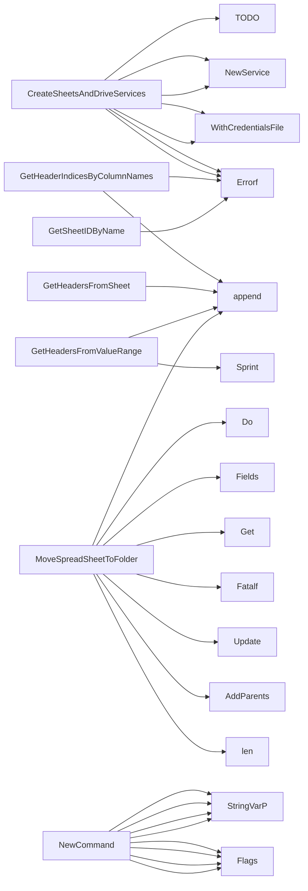

## Package resultsspreadsheet (github.com/redhat-best-practices-for-k8s/certsuite/cmd/certsuite/upload/results_spreadsheet)

### Functions

- **CreateSheetsAndDriveServices** — func(string)(*sheets.Service, *drive.Service, error)
- **GetHeaderIndicesByColumnNames** — func([]string, []string)([]int, error)
- **GetHeadersFromSheet** — func(*sheets.Sheet)([]string)
- **GetHeadersFromValueRange** — func(*sheets.ValueRange)([]string)
- **GetSheetIDByName** — func(*sheets.Spreadsheet, string)(int64, error)
- **MoveSpreadSheetToFolder** — func(*drive.Service, *drive.File, *sheets.Spreadsheet)(error)
- **NewCommand** — func()(*cobra.Command)

### Globals

### Call graph (exported symbols, partial)

### Symbol docs

- [function CreateSheetsAndDriveServices](symbols/function_CreateSheetsAndDriveServices.md)
- [function GetHeaderIndicesByColumnNames](symbols/function_GetHeaderIndicesByColumnNames.md)
- [function GetHeadersFromSheet](symbols/function_GetHeadersFromSheet.md)
- [function GetHeadersFromValueRange](symbols/function_GetHeadersFromValueRange.md)
- [function GetSheetIDByName](symbols/function_GetSheetIDByName.md)
- [function MoveSpreadSheetToFolder](symbols/function_MoveSpreadSheetToFolder.md)
- [function NewCommand](symbols/function_NewCommand.md)
