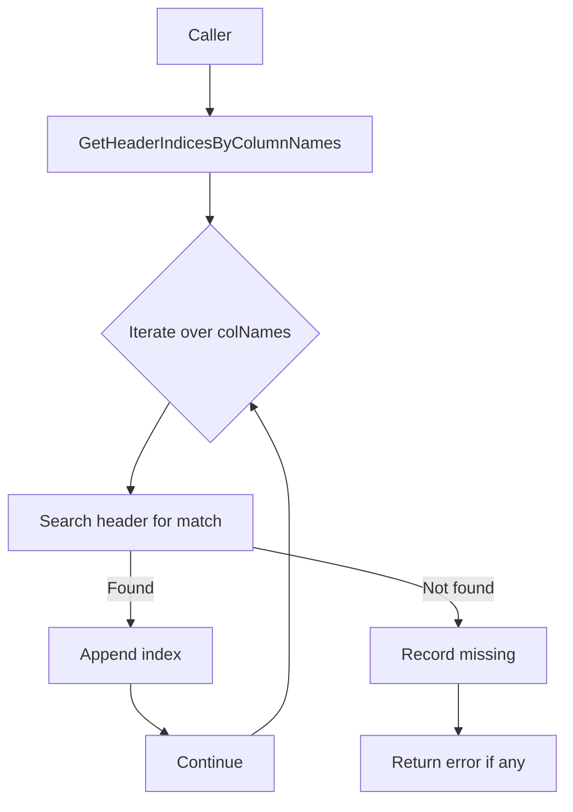

GetHeaderIndicesByColumnNames`

> **Package**: `resultsspreadsheet`  
> **Location**: `cmd/certsuite/upload/results_spreadsheet/sheet_utils.go`

## Purpose
`GetHeaderIndicesByColumnNames` is a helper that maps user‑supplied column names to the positions of those columns in an Excel sheet header row.  
It is used by other commands that need to read specific data from a spreadsheet (e.g., the *Conclusion* or *Raw Results* sheets) without hard‑coding column indexes.

## Signature
```go
func GetHeaderIndicesByColumnNames(header []string, colNames []string) ([]int, error)
```

| Parameter | Type     | Description |
|-----------|----------|-------------|
| `header`  | `[]string` | The slice of header values from the first row of an Excel sheet. |
| `colNames`| `[]string` | Column names that callers want to locate within `header`. |

| Return | Type | Description |
|--------|------|-------------|
| `[]int` | Slice of indexes (zero‑based) corresponding to each name in `colNames`. The order matches the order of `colNames`. |
| `error` | If any requested column name is not found, an error describing which names were missing is returned. |

## Core Logic
1. **Iterate** over every desired column name (`colNames`).  
2. For each name, search through `header` for a match.  
3. When found, append the index to a result slice.  
4. If no match is found after scanning all header values, record the missing name.  
5. After processing all names, if any were missing, return an error using `fmt.Errorf`; otherwise return the indices slice and a nil error.

The function uses only Go's standard library (`append`, `Errorf`), so it has no external dependencies or side effects beyond its inputs/outputs.

## Side Effects
- None. The function performs pure computation; it neither mutates its arguments nor interacts with global state.

## Package Integration
Within the *results‑spreadsheet* command set, this helper is called by code that:
- Opens a Google Sheets document via the `uploadResultSpreadSheetCmd` infrastructure.
- Reads the first row (header) from sheets such as **Conclusion** or **Raw Results**.
- Needs to know where specific columns like “Workload Name” or “Operator Version” reside.

By abstracting the index‑lookup logic, callers can remain agnostic of column order changes in the spreadsheet template. This makes the command robust against updates to the sheet layout while keeping the code readable.

## Example Usage
```go
header := []string{"ID", "Workload Name", "Operator Version", "Result"}
colNames := []string{"Workload Name", "Operator Version"}

indices, err := GetHeaderIndicesByColumnNames(header, colNames)
if err != nil {
    log.Fatalf("missing columns: %v", err)
}
// indices == []int{1, 2}
```

## Mermaid Diagram (Optional)



---
