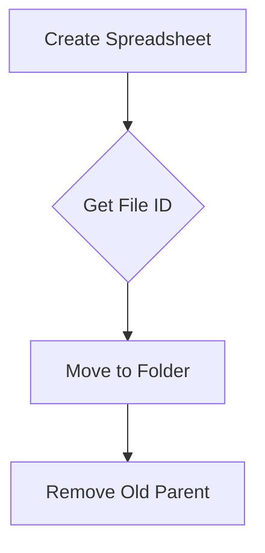

MoveSpreadSheetToFolder`

| Aspect | Detail |
|--------|--------|
| **Signature** | `func(*drive.Service, *drive.File, *sheets.Spreadsheet) error` |
| **Exported?** | Yes (public API of the package) |

### Purpose
`MoveSpreadSheetToFolder` relocates a Google Drive spreadsheet that was just created/updated into a specific folder on the user’s drive.  
The function performs two steps:

1. **Adds** the spreadsheet to the target folder (`rootFolderURL`) via `AddParents`.
2. **Removes** any existing parent folders so the file appears only in the desired location.

This keeps test‑result spreadsheets tidy and predictable for downstream consumers (e.g., CI dashboards).

### Parameters

| Name | Type | Meaning |
|------|------|---------|
| `srv` | `*drive.Service` | Authenticated Drive client used to modify metadata. |
| `file` | `*drive.File` | The Drive file object that represents the spreadsheet to move. |
| `spreadsheet` | `*sheets.Spreadsheet` | Not used directly inside this function; it is passed for symmetry with other helpers but can be omitted without side‑effects. |

### Return Value
- `error`:  
  *`nil`* if both Drive operations succeed, otherwise an error describing the first failure encountered.

### Key Dependencies

| Call | Purpose |
|------|---------|
| `srv.Files.Update(file.Id).AddParents(rootFolderURL)` | Attach file to target folder. |
| `srv.Files.Update(file.Id).RemoveParents(originalParentId)` | Detach from previous parent (ensures single location). |
| `Fatalf` (from the package’s logger) | Terminate the program on unexpected errors; this is a side effect that should be noted when integrating. |

The function relies on the global variable **`rootFolderURL`** which holds the Drive folder ID where all result spreadsheets must reside.

### Side‑Effects

- The file’s metadata in Google Drive changes: its parent folders are updated.
- Any error during the Drive calls will trigger `log.Fatalf`, causing the entire program to exit.  
  This behavior is intentional for a CLI tool but may be undesirable in library contexts.

### How It Fits the Package

`resultsspreadsheet` orchestrates the creation of spreadsheets that contain test results. After a spreadsheet is generated, it must be stored in a consistent location so other tools (e.g., result viewers) can find it.  
`MoveSpreadSheetToFolder` is the glue that moves the freshly created file into `rootFolderURL`, ensuring all uploads share a common root folder.

---

#### Suggested Mermaid diagram

This illustrates the two Drive API calls performed by `MoveSpreadSheetToFolder`.
