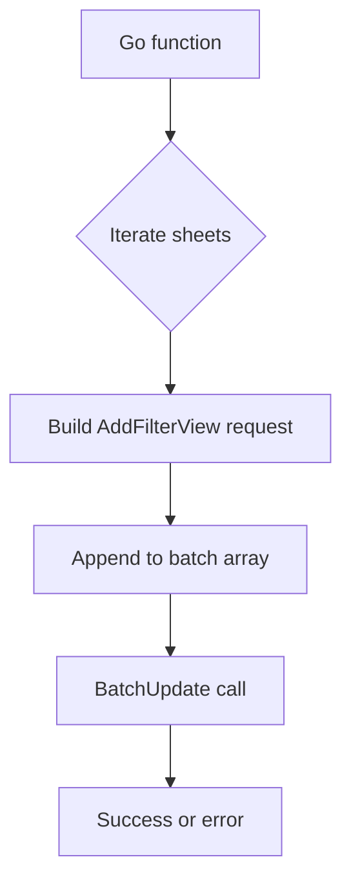

addBasicFilterToSpreadSheet`

| Aspect | Details |
|--------|---------|
| **Package** | `resultsspreadsheet` (cmd/certsuite/upload/results_spreadsheet) |
| **Visibility** | Unexported – used only inside the package |
| **Signature** | `func addBasicFilterToSpreadSheet(sheetsService *sheets.Service, spreadsheet *sheets.Spreadsheet) error` |

---

### Purpose
The function adds a *basic filter* (Google Sheets “Data → Create a filter”) to every sheet in the supplied spreadsheet.  
A basic filter lets users hide/show rows per column without editing the underlying data.

---

### Inputs

| Parameter | Type | Description |
|-----------|------|-------------|
| `sheetsService` | `*sheets.Service` | Authenticated Google Sheets API client used for all RPC calls. |
| `spreadsheet` | `*sheets.Spreadsheet` | The spreadsheet that already contains the result sheets (e.g., “Raw Results”, “Single Workload Results”). |

---

### Output

- Returns an `error`.  
  - `nil` on success.  
  - Any API error returned by the Google Sheets service is propagated.

---

### Key Steps & Dependencies

1. **Iterate over all sheet IDs**  
   ```go
   for _, sheet := range spreadsheet.Sheets {
       ...
   }
   ```
2. **Create a filter request**  
   For each sheet, build a `sheets.Request` that calls the `AddFilterView` method with:
   - `range_`: the entire sheet (`"A1:Z1000"` style; actual range built from sheet properties).  
   - A new `FilterView` object (default values – just enables filtering).
3. **Batch update**  
   All requests are collected in a single `sheets.BatchUpdateSpreadsheetRequest` and sent via:
   ```go
   _, err := sheetsService.Spreadsheets.BatchUpdate(spreadsheet.GetSpreadsheetId(), batch).Do()
   ```
4. **Error handling** – any error from `Do()` is returned.

> **Dependencies**  
> *Google Sheets API v4* (`google.golang.org/api/sheets/v4`).  
> The function uses the standard client methods: `BatchUpdate`, `Do`.

---

### Side Effects

- Modifies the live spreadsheet on Google Drive – a filter view appears in each sheet.
- No changes to cell data or formatting beyond adding the filter UI.

---

### Where It Fits in the Package

The package orchestrates uploading test results into a Google Spreadsheet.  
Typical flow:

1. Create/identify the spreadsheet (`createResultSpreadsheet`).  
2. Add raw result rows (`addRawResultsToSheet`, etc.).  
3. **Add filters** – `addBasicFilterToSpreadSheet` is called after all data has been written, ensuring users can easily navigate large tables.

---

### Example Usage (internal)

```go
if err := addBasicFilterToSpreadSheet(sheetsService, spreadsheet); err != nil {
    log.Fatalf("Failed to apply filter: %v", err)
}
```

--- 

#### Mermaid Diagram – Flow of Requests



This succinctly shows how each sheet’s filter is added in a single API round‑trip.
