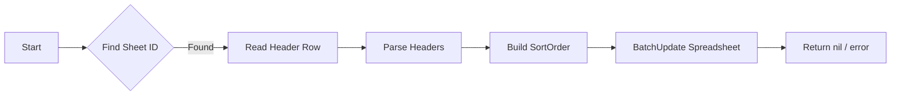

addDescendingSortFilterToSheet`

Adds a *descending* sort filter to an existing Google Sheet.  
The function is used by the results‑upload command to make the
generated spreadsheet easier to read: it sorts rows in descending order on
the first column that contains the header `"Result"` (or any other
header defined by `conclusionSheetHeaders`).

```go
func addDescendingSortFilterToSheet(
    service *sheets.Service,
    ss      *sheets.Spreadsheet,
    sheetName string,   // name of the sheet to modify
    headerCol string,   // column letter (e.g. "A") that contains the sort key
) error
```

## Parameters

| Name | Type | Description |
|------|------|-------------|
| `service` | `*sheets.Service` | Google Sheets API client used for all RPC calls. |
| `ss` | `*sheets.Spreadsheet` | In‑memory representation of the spreadsheet that will be updated. |
| `sheetName` | `string` | Name of the sheet (tab) to apply the filter on. |
| `headerCol` | `string` | Column letter that holds the header row; this column is used as the sort key. |

## Return Value

* `error`: non‑nil if any step fails (API call, missing sheet,
  invalid header, etc.). A nil error indicates that a filter has been
  added successfully.

## Workflow

1. **Locate Sheet ID**  
   Calls `GetSheetIDByName` to find the numeric ID of `sheetName`.  
   If not found → returns an error.

2. **Read Header Row**  
   * Build a request for `spreadsheets.values.get`.
   * Target range: `{sheetName}!{headerCol}:{headerCol}` – only the first
     column containing the header row.
   * Execute via `service.Spreadsheets.Values.Get(...).Do()`.

3. **Determine Header Index**  
   * Convert the value‑range into a slice of headers using
     `GetHeadersFromValueRange`.
   * Find the index of `headerCol` within that slice by calling
     `GetHeaderIndicesByColumnNames`.

4. **Create Sort Order Request**  
   * Construct a `sheets.SortOrder` with:
     ```go
     Field:  fmt.Sprintf("%d", headerIndex+1), // 1‑based column index
     Descending: true,
     ```
   * Wrap this in a `sheets.Request{SortRange: {...}}`.

5. **Batch Update**  
   * Build a `sheets.BatchUpdateSpreadsheetRequest` with the sort request.
   * Execute via `service.Spreadsheets.BatchUpdate(ss.SpreadsheetId, req).Do()`.

6. **Return**  
   * Any error from the API calls is wrapped with `fmt.Errorf`
     and returned; otherwise nil.

## Dependencies

| Function | Purpose |
|----------|---------|
| `GetSheetIDByName` | Resolve sheet name → numeric ID. |
| `GetHeadersFromValueRange` | Extract header strings from a value range. |
| `GetHeaderIndicesByColumnNames` | Map header names to column indices. |
| Google Sheets API (`Do`, `BatchUpdate`) | Perform the actual spreadsheet modifications. |

## Side Effects

* The target sheet in the live spreadsheet gains a filter view that
  sorts all rows by the specified column in descending order.
* No other sheets or data are modified.

## Package Context

`addDescendingSortFilterToSheet` is part of the *results‑spreadsheet*
command package, which uploads CertSuite test results to Google Sheets.  
After the spreadsheet is created and populated with raw results,
this helper is called on each relevant sheet (e.g.,
`ConclusionSheetName`, `SingleWorkloadResultsSheetName`) so that end‑users
see the most recent or critical results first.

--- 

**Mermaid diagram suggestion**



This function is a low‑level utility; its correctness depends on the
helper functions that locate sheets and parse headers.  If any of those
helpers return an unexpected result, `addDescendingSortFilterToSheet`
will propagate the error to the caller.
